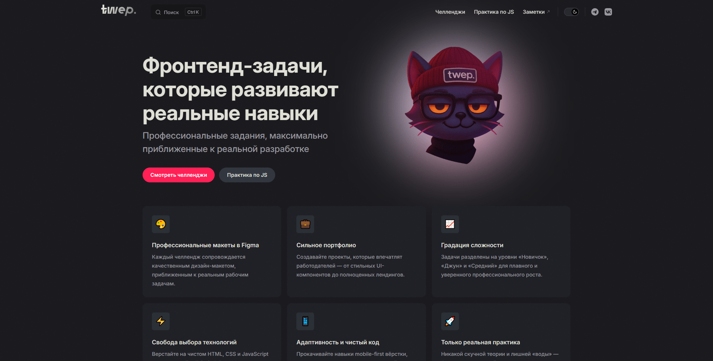

# twep.

## О проекте

**twep.** — это открытая платформа практических заданий и челленджей по веб-разработке (HTML, CSS, JavaScript). Платформа создана для тех, кто хочет перейти от сухой теории к созданию реальных проектов, научиться верстать по профессиональным Figma-макетам и собрать убедительное портфолио для трудоустройства.

[](https://twep.ru)
[](https://t.me/twepru)
[](https://vkvideo.ru/@twepru)



## Ключевые особенности

- **Реальные макеты из Figma**: каждый челлендж содержит качественный дизайн-макет, приближенный к коммерческим задачам.
- **Градация сложности**:
  - **Новичок (15 задач)** — базовые UI-компоненты, семантическая вёрстка, стилизация карточек, таблиц и виджетов.
  - **Джун (5 задач)** — адаптивные лендинги, сложные бенто-сетки, мобильные меню и интерактивные интерфейсы.
  - **Средний (3 задачи)** — полноценные SaaS-страницы, генераторы и сайты-портфолио.
- **Практика по JavaScript**: интерактивные задачи с пошаговыми инструкциями, видео-демонстрациями и разбором решений.
- **Свобода выбора стека**: верстайте на чистом HTML/CSS/JS или используйте Tailwind, React, Vue, Svelte и др.
- **Сообщество и код-ревью**: возможность делиться решениями и получать обратную связь через комментарии (Giscus / GitHub Discussions).
- **Тёмная и светлая темы**, полнотекстовый локальный поиск и адаптивный дизайн.

## Структура проекта

```text
twep/
├── docs/
│   ├── .vitepress/           # Конфигурация VitePress, тема и компоненты
│   │   ├── components/       # Vue-компоненты (аккордеон FAQ, бейджи, комментарии)
│   │   ├── data/             # JSON-данные для компонентов
│   │   ├── nav/              # Навигационные схемы и сайдбары
│   │   ├── theme/            # Стили темы (Tailwind CSS, кастомный Layout)
│   │   └── config.mjs        # Главный файл конфигурации сайта
│   ├── challenges/           # Материалы и описания челленджей по уровням
│   │   ├── newbie/           # Задания для новичков
│   │   ├── junior/           # Задания уровня джуниор
│   │   └── intermediate/     # Задания среднего уровня
│   ├── js/                   # Практические задания по JavaScript
│   ├── public/               # Статические файлы, логотипы и изображения
│   └── index.md              # Главная страница сайта
├── package.json              # Зависимости и скрипты
└── README.md                 # Документация проекта
```

## Стек технологий

- **[VitePress](https://vitepress.dev/)** — быстрый генератор статической документации на Vue 3 и Vite
- **[Tailwind](https://tailwindcss.com/)** — современный CSS-фреймворк
- **[Giscus](https://giscus.app/)** — система комментариев на базе GitHub Discussions

## Credits

Вдохновлено [Frontend Mentor](https://www.frontendmentor.io/)
