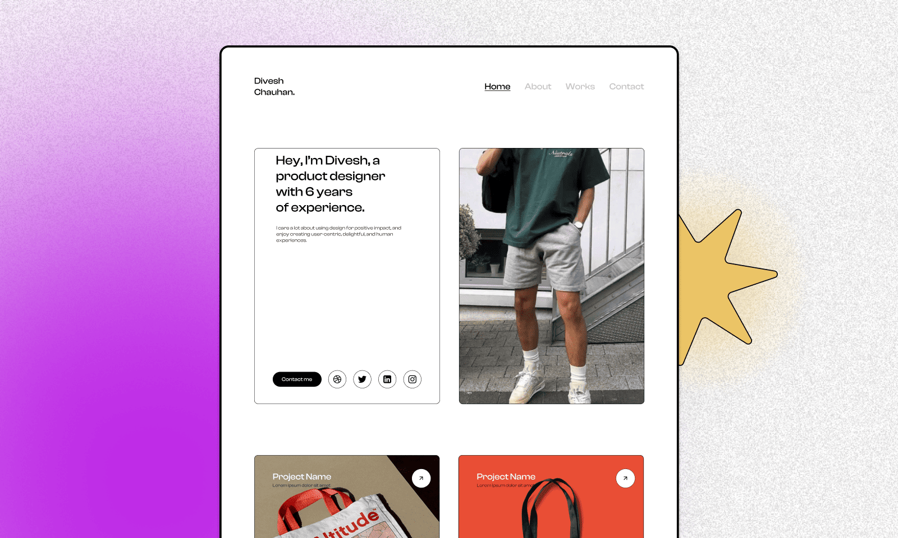

# {{ $frontmatter.title}}

<ChallengesBadges type="html" />
<ChallengesBadges type="css" />
<ChallengesBadges type="js" />

Этот многостраничный сайт-портфолио станет отличным вызовом, чтобы проверить ваши универсальные навыки фронтенд-разработки. Вы даже сможете использовать этот сайт в качестве собственного портфолио, когда завершите его!

### Макет

[Макет в Figma](https://www.figma.com/community/file/1201154760208068493/minimalistic-portfolio-template) (Minimalistic Portfolio Template)

## 📝 Задача

Ваша задача — создать этот многостраничный сайт-портфолио и максимально точно воспроизвести предоставленный дизайн.

Вы можете использовать любые инструменты по своему усмотрению для выполнения задания. Если вы хотите потренироваться в чём-то конкретном — дерзайте!

Кроме того, поскольку это задание предполагает создание портфолио, вы можете смело использовать готовый сайт в качестве собственного портфолио после завершения!

**Ваши пользователи должны иметь возможность:**

1. Нажать на кнопку-призыв к действию "Contact Me" на главной странице, после чего должна открываться страница "Contact".
2. Получать сообщения об ошибках при отправке контактной формы в следующих случаях:

   - Если поля «Имя» или «Адрес электронной почты» не заполнены — отображать сообщение: «Это поле обязательно для заполнения».
   - Если адрес электронной почты указан в неверном формате — отображать сообщение: «Пожалуйста, укажите корректный адрес электронной почты».

3. Сайт должен хорошо выглядеть на любом экране.
4. Видеть состояния при наведении курсора `hover` и при фокусе `focus` для всех интерактивных элементов на странице.

## 💡 Идеи для практики

1. Напишите стили с использованием препроцессора, например Sass, Less или Stylus.
2. Тренируйте внимание к деталям, добиваясь максимального сходства вашего решения с макетом.
3. Попробуйте заранее оценить, сколько времени у вас займёт выполнение проекта. Затем сравните вашу оценку с реальным временем. Умение давать точные оценки — важный, хотя и часто недооцениваемый навык профессиональных разработчиков.

## 🤔 FAQ

<ChallengesAccordion />
