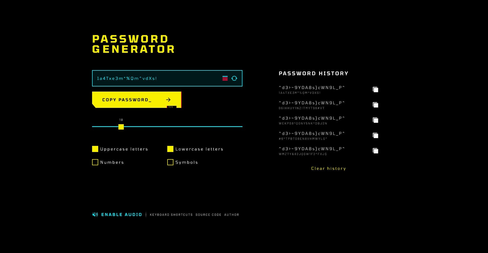

# {{ $frontmatter.title}}

<ChallengesBadges type="html" />
<ChallengesBadges type="css" />
<ChallengesBadges type="js" />

Это приложение станет отличной проверкой ваших навыков в HTML, CSS и JavaScript. Вам предстоит создать собственные элементы управления формой и использовать JavaScript для генерации случайных паролей.

### Макет

[Макет в Figma](https://www.figma.com/community/file/1167934186210755390/cyberpunk-themed-password-generator) (Cyberpunk Themed Password Generator)

## 📝 Задача

Ваша задача — создать приложение для генерации паролей и максимально точно воспроизвести предоставленный дизайн.

Вы можете использовать любые инструменты по своему усмотрению. Если вы хотите потренироваться в чём-то конкретном — смело пробуйте!

**Ваши пользователи должны иметь возможность:**

- Генерировать пароль в соответствии с выбранными параметрами (например, включать или исключать заглавные буквы, цифры, символы и т.д.).
- Копировать сгенерированный пароль в буфер обмена компьютера.
- Видеть оценку надёжности (уровень сложности) сгенерированного пароля.

Сайт должен хорошо выглядеть на любом экране.

Видеть состояния при наведении курсора `hover` и при фокусе `focus` для всех интерактивных элементов на странице.

## 💡 Идеи для практики

1. Напишите стили с использованием препроцессора, например Sass, Less или Stylus.
2. Тренируйте внимание к деталям, добиваясь максимального сходства вашего решения с макетом.
3. Используйте JavaScript-фреймворк или библиотеку, чтобы потренироваться в работе с шаблонами и/или создании приложения на основе компонентов.
4. Попробуйте заранее оценить, сколько времени у вас займёт выполнение проекта. Затем сравните вашу оценку с реальным временем. Умение давать точные оценки — важный, хотя и часто недооцениваемый навык профессиональных разработчиков.

## 🤔 FAQ

<ChallengesAccordion />
