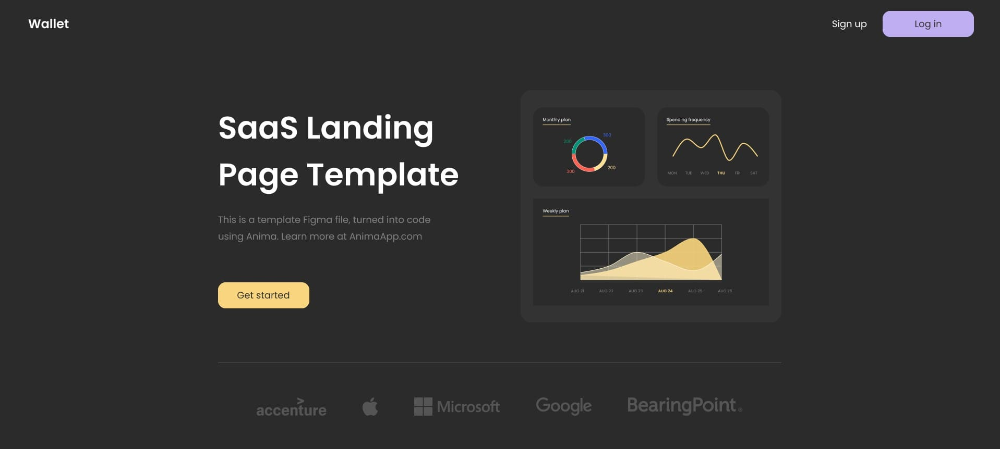

# {{ $frontmatter.title}}

<ChallengesBadges type="html" />
<ChallengesBadges type="css" />
<ChallengesBadges type="js" />

Это задание станет отличной проверкой ваших навыков вёрстки. Если вы готовы перейти от задач для начинающих к более сложным — это отличный следующий шаг.

### Макет

[Макет в Figma](https://www.figma.com/community/file/1091046863319888542/saas-landing-page-template-landing-page-template-ready-to-export-to-html-landing-page-for-saas) (SaaS Landing Page Template)

## 📝 Задача

Ваша задача — сверстать этот лендинг и максимально точно воспроизвести предоставленный дизайн.

Вы можете использовать любые инструменты по своему усмотрению. Если вы хотите потренироваться в чём-то конкретном — смело пробуйте!

Единственная функциональность на JavaScript, которая требуется, — это переключение мобильного меню навигации. Однако вы также можете попробовать реализовать это без использования JavaScript.

Сайт должен хорошо выглядеть на любом экране.  

Видеть состояния при наведении курсора `hover` и при фокусе `focus` для всех интерактивных элементов на странице.

## 💡 Идеи для практики

1. Напишите стили с использованием препроцессора, например Sass, Less или Stylus.
2. Тренируйте внимание к деталям, добиваясь максимального сходства вашего решения с макетом.
3. Попробуйте заранее оценить, сколько времени у вас займёт выполнение проекта. Затем сравните вашу оценку с реальным временем. Умение давать точные оценки — важный, хотя и часто недооцениваемый навык профессиональных разработчиков.

## 🤔 FAQ

<ChallengesAccordion />
