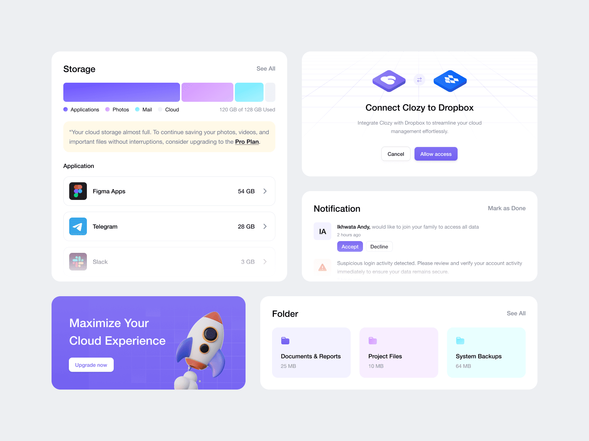

# {{ $frontmatter.title}}

<ChallengesBadges type="html" />
<ChallengesBadges type="css" />

Этот набор компонентов в бенто-стиле содержит в дизайне несколько интересных задач по CSS. Если вы хотите проверить свои навыки в CSS — это отличный проект для вас!

### Макет

[Макет в Figma](https://www.figma.com/community/file/1389882821010218995/clozy-cloud-platform-component) (Clozy - Cloud Platform Component)

## 📝 Задача

Ваша задача — сверстать набор компонентов с информацией об объёме памяти на диске и сделать их максимально похожим на предоставленный макет.

Вы можете использовать любые инструменты, которые помогут вам выполнить задачу. Так что если вы хотите попрактиковаться в чём-то конкретном — не стесняйтесь и пробуйте.

Сайт должен хорошо выглядеть на любом экране.

## 💡 Идеи для практики

1. Напишите стили с использованием препроцессора, например Sass, Less или Stylus.
2. Тренируйте внимание к деталям, добиваясь максимального сходства вашего решения с макетом.
3. Попробуйте заранее оценить, сколько времени у вас займёт выполнение проекта. Затем сравните вашу оценку с реальным временем. Умение давать точные оценки — важный, хотя и часто недооцениваемый навык профессиональных разработчиков.

## 🤔 FAQ

<ChallengesAccordion />
