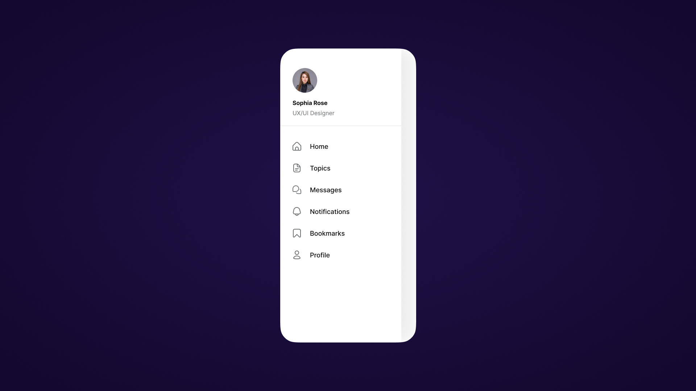

# {{ $frontmatter.title}}

<ChallengesBadges type="html" />
<ChallengesBadges type="css" />
<ChallengesBadges type="js" />



### Макет

[Макет в Figma](https://www.figma.com/community/file/1383437775855184937/animated-mobile-app-navigation-side-menu-bar-ui-template) (Animated Mobile App Navigation Side Menu Bar UI template)

## 📝 Задача

В этом задании вам предстоит сверстать адаптивное мобильное меню с иконкой-гамбургером и плавным выпадающим списком. Необходимо реализовать корректное открытие наложения (overlay) при клике и убедиться, что навигация удобно управляется на тач-экранах.

## 💡 Идеи для практики

1. Добавьте визуальный отклик при нажатии на пункты меню и реализуйте блокировку прокрутки основной страницы (overflow: hidden для body), когда меню открыто.
2. Используйте плавные переходы (transition) для появления меню и превращения «бургера» в крестик, чтобы интерфейс выглядел живым и отзывчивым.
3. Соблюдайте доступность (A11y): используйте семантический тег ```<nav>``` и убедитесь, что кнопка меню доступна для управления с клавиатуры и корректно считывается скринридерами.

## 🤔 FAQ

<ChallengesAccordion />
