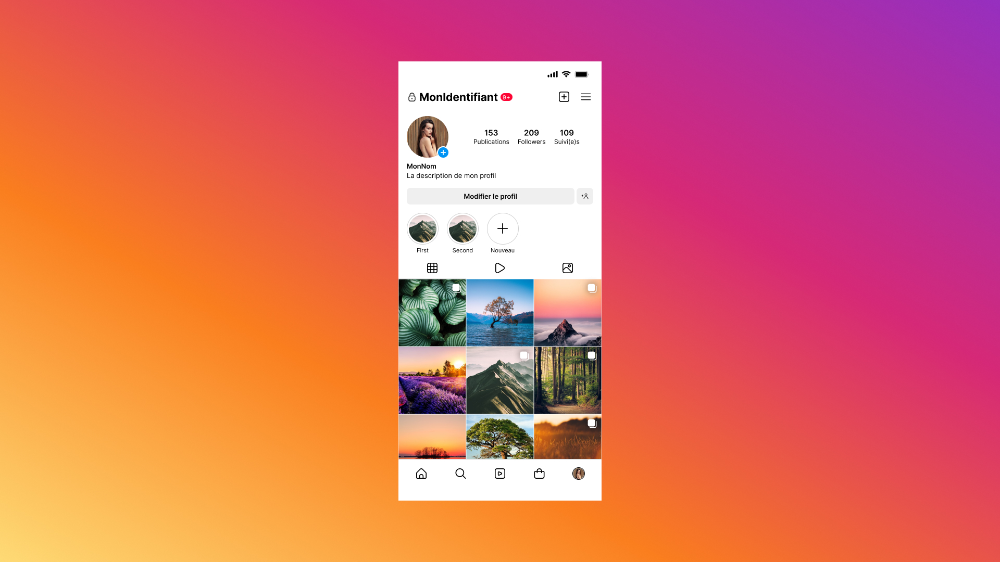

# {{ $frontmatter.title}}

<ChallengesBadges :types="['html', 'css']" />

Создание страницы профиля социальной сети — это классическая задача на проверку умения работать с комбинированными раскладками. Здесь необходимо гармонично сочетать гибкие контейнеры (Flexbox) для шапки профиля и жесткую модульную сетку (Grid) для галереи публикаций.

Этот челлендж научит вас выстраивать иерархию контента, работать с адаптивными изображениями и реализовывать интерфейсные паттерны, привычные миллионам пользователей.

### Макет

[Ссылка на макет в Figma](https://www.figma.com/community/file/1181291250030899098/instagram-mockup-template) (Instagram Mockup/Template)

## 📝 Задача

Вам необходимо сверстать адаптивную копию страницы личного профиля. Основное внимание следует уделить двум зонам:

1. **Шапка профиля:** Аватар, статистика (публикации, подписчики, подписки), имя и био. Используйте **Flexbox** для выравнивания элементов.
2. **Сетка публикаций:** Галерея изображений в формате 3х3. Используйте **CSS Grid** для создания идеальных квадратов и управления отступами.

## 💡 Идеи для практики

1. **Технологический стек:** Вы можете использовать любые технологии для выполнения задания: CSS-препроцессоры (Sass/Less), современные фреймворки (Tailwind CSS) или методологию БЭМ.
2. **Гибкость реализации:** «Пиксель-перфект» не является обязательным требованием, но приветствуется. Вы имеете полное право на творческие эксперименты в рамках предложенного стиля.
3. **Интерактивность:** Попробуйте реализовать эффект `hover` при наведении на публикацию (появление иконок лайков и комментариев) или открытие изображения в модальном окне при клике.
4. **Адаптивность:** Настройте сетку так, чтобы на мобильных устройствах количество колонок уменьшалось, а элементы шапки перестраивались в вертикальный стек.

## 🤔 FAQ

<ChallengesAccordion />
