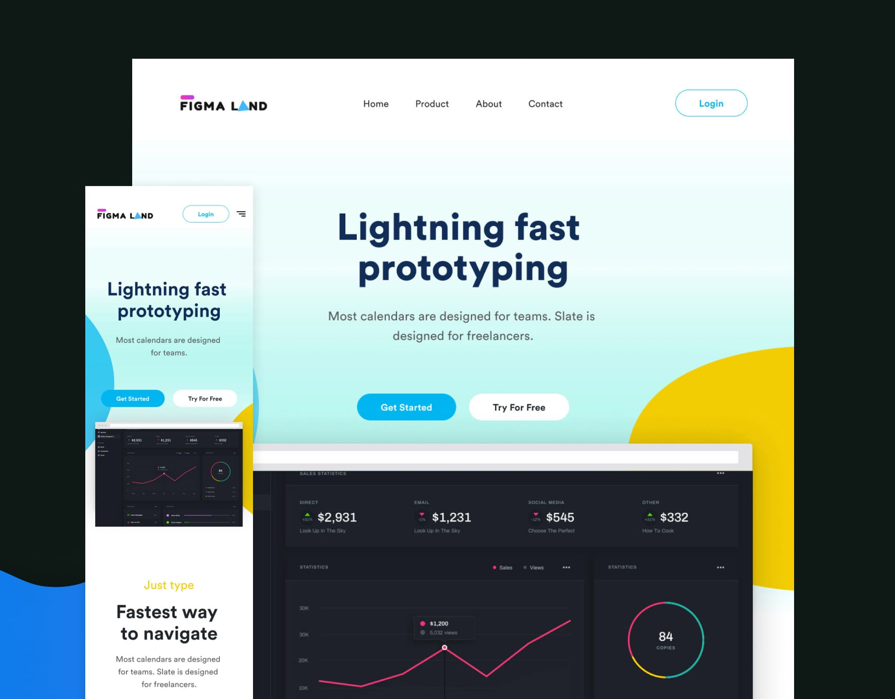

# {{ $frontmatter.title}}

<ChallengesBadges type="html" />
<ChallengesBadges type="css" />

Это станет отличной проверкой ваших навыков HTML и CSS. В дизайне используются распространённые паттерны вёрстки, с которыми вы, скорее всего, столкнётесь в будущих проектах, а также интересные детали.

### Макет

[Макет в Figma](https://www.figma.com/community/file/827486884812639090/figma-startup-landing-page) (Figma startup landing page)

## 📝 Задача

Ваша задача — сверстать этот простой технологичный лендинг и сделать его максимально похожим на предоставленный макет.

Вы можете использовать любые инструменты, которые помогут вам выполнить задачу. Так что если вы хотите попрактиковаться в чём-то конкретном — не стесняйтесь и пробуйте.

Сайт должен хорошо выглядеть на любом экране.

Видеть состояния при наведении курсора `hover` и при фокусе `focus` для всех интерактивных элементов на странице.

## 💡 Идеи для практики

1. Добавьте плавные и интересные переходы при наведении на интерактивные элементы.
2. Реализуйте всплывающее уведомление («тост») или другое сообщение об успехе, когда пользователь нажимает кнопку «Начать».

## 🤔 FAQ

<ChallengesAccordion />
