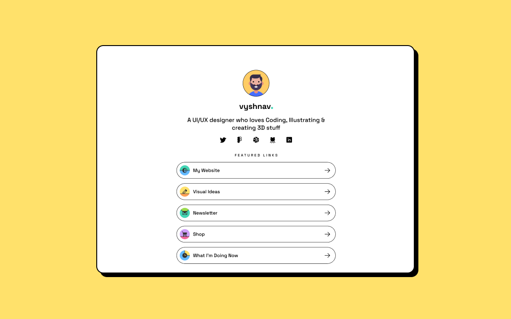

# {{ $frontmatter.title}}  

<ChallengesBadges type="html" />
<ChallengesBadges type="css" />

В этом небольшом проекте вы создадите карточку для публикации ссылок на социальные сети, получится что-то вроде Linktree. Вы даже можете персонализировать его под себя.

## Задача

Ваша задача — сверстать профиль со ссылками на социальные сети, чтобы он выглядел максимально близко к предоставленному макету.

Вы можете использовать любые инструменты, которые помогут вам выполнить задачу. Так что если вы хотите попрактиковаться в чём-то конкретном — не стесняйтесь и пробуйте.

**Пользователи должны иметь возможность:**

- Видеть состояния при наведении курсора (`hover`) и фокусе (`focus`) для всех интерактивных элементов на странице.

Откройте макет у себя. На странице `Design` вы найдете дизайны для настольной и мобильной версий. На странице `Components` вы найдете ховер-эффекты и иконки.

## Идеи для практики

- Персонализируйте проект, добавив свою информацию, ссылки и цветовую палитру.
- Сосредоточьтесь на написании семантического HTML-кода, используя правильные элементы в соответствии с содержанием.
- Убедитесь, что посетители могут перемещаться по ссылкам, используя только клавиатуру.
- Тренируйте внимание к деталям, добиваясь максимального сходства вашего решения с макетом.

## FAQ

- **Нужна помощь в выполнении задачи?**  
Читайте и оставляйте комментарии снизу.

## Ссылки

[Links - UI Design](https://www.figma.com/community/file/1140170887273934289/links-ui-design) (Макет в Figma)  
[Пример страницы вживую](https://links.vyshnav.xyz/) (Сайт Vyshnav Gangadharan)
