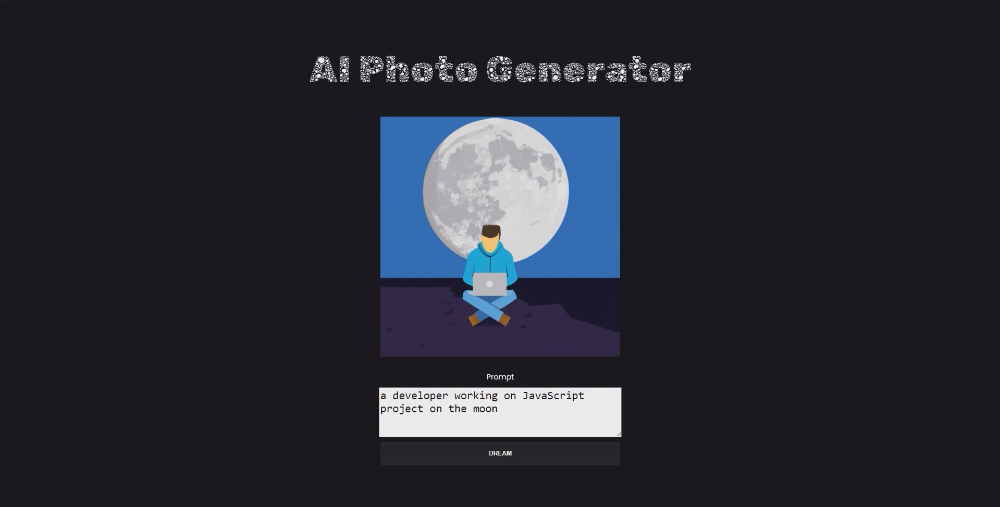
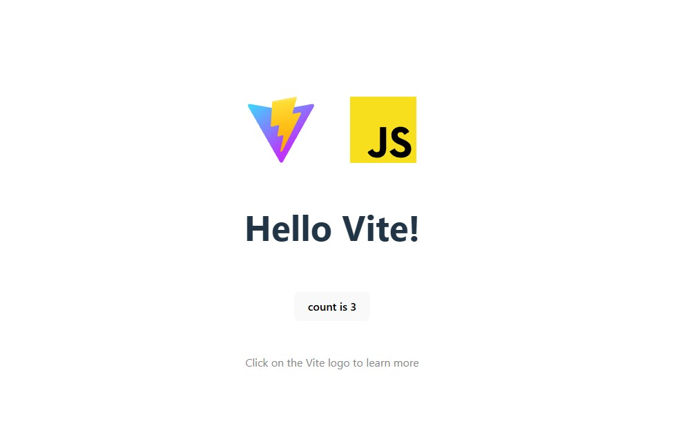

# {{ $frontmatter.title}}

<ModernJsMeta :level="$frontmatter.level" :theme="$frontmatter.theme"/>

Теперь, когда мы изучили несколько алгоритмов, переходим к практике — создадим полноценное full-stack приложение на JavaScript. Этот проект будет простым, но охватит все ключевые принципы, которые используются при разработке реальных веб-приложений.

## Что мы будем создавать?

Мы разработаем приложение, которое с помощью искусственного интеллекта превращает текст в изображение. Пользователь вводит описание (например, «космический корабль над планетой»), а приложение генерирует соответствующее изображение.

Мы создадим приложение на чистом JavaScript с использованием Vite. Vite — это быстрый и легковесный сервер для разработки, который использует нативные ES-модули для запуска вашего кода.  

Приложение также задействует OpenAI Image Generation API для генерации уникальных изображений с помощью модели DALL·E 2.  



## Как это работает?

1. **Фронтенд (браузер):**  
   - Пользователь заполняет форму на странице и нажимает кнопку «Отправить».  
   - Интерфейс переходит в состояние загрузки, пока идёт обработка запроса.

2. **Бэкенд (сервер на Node.js):**  
   - Фронтенд отправляет HTTP-запрос на сервер.  
   - Сервер обращается к API OpenAI (DALL·E), передавая текстовое описание.  
   - Важно: ключ API хранится на сервере и **не попадает в браузер**, чтобы не скомпрометировать безопасность.

3. **Результат:**  
   - OpenAI возвращает ссылку на сгенерированное изображение.  
   - Сервер передаёт эту ссылку обратно фронтенду.  
   - Браузер отображает изображение пользователю.

## Почему нужен бэкенд?

Фронтенд работает в браузере пользователя, и любой код там может быть просмотрен. Поэтому конфиденциальные данные (например, API-ключи, пароли, логика доступа к базе данных) должны обрабатываться на сервере. Бэкенд — это «доверенная зона», где выполняется безопасный код.

**Типичные задачи сервера:**
- Работа с базами данных
- Аутентификация пользователей
- Взаимодействие с внешними API
- Валидация и обработка данных

## Начало проекта: настройка фронтенда

Для ускорения разработки мы воспользуемся современным инструментом — **[Vite](https://vite.dev/)**.

Откройте терминал и выполните:

```bash
npm create vite@latest
```

Вам предложат ввести имя проекта. Укажите его, например:

```
my-ai-image-app
```

Затем выберите шаблон:  
→ При появлении запроса выберите **vanilla** — это чистый JavaScript без дополнительных фреймворков.

После создания проекта перейдите в его папку:

```bash
cd my-ai-image-app
```

Установите зависимости:

```bash
npm install
```

Запустите приложение в режиме разработки:

```bash
npm run dev
```

Откройте браузер и перейдите по адресу, который покажет терминал (обычно `http://localhost:5173`). Вы увидите стандартную страницу приветствия Vite — это значит, фронтенд настроен успешно.



## Что дальше?

В следующем уроке мы создадим сервер на Node.js и настроим взаимодействие между фронтендом и API OpenAI.