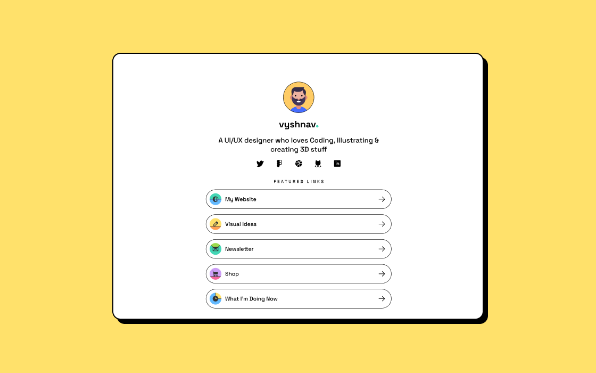

# {{ $frontmatter.title}}

<ChallengesBadges :types="['html', 'css']" />

В этом небольшом проекте вы создадите карточку для публикации ссылок на социальные сети, получится что-то вроде Linktree. Вы даже можете персонализировать его под себя.

### Макет

[Макет в Figma](https://www.figma.com/community/file/1140170887273934289/links-ui-design) (Links - UI Design)  
[Сайт Vyshnav Gangadharan](https://links.vyshnav.xyz/) (Пример страницы вживую)

## 📝 Задача

Ваша задача — сверстать профиль со ссылками на социальные сети, чтобы он выглядел максимально близко к предоставленному макету.

Вы можете использовать любые инструменты, которые помогут вам выполнить задачу. Так что если вы хотите попрактиковаться в чём-то конкретном — не стесняйтесь и пробуйте.

Откройте макет у себя. На странице `Design` вы найдете дизайны для настольной и мобильной версий. На странице `Components` вы найдете ховер-эффекты и иконки.

**Пользователи должны иметь возможность:**

- Видеть состояния при наведении курсора `hover` и при фокусе `focus` для всех интерактивных элементов на странице.

## 💡 Идеи для практики

1. Персонализируйте проект: добавьте свою информацию, свои ссылки на социальные сети, свои цвета.
2. Сосредоточьтесь на написании семантического HTML-кода, используя правильные элементы в соответствии с содержанием.
3. Убедитесь, что посетители могут перемещаться по ссылкам, используя только клавиатуру.
4. Тренируйте внимание к деталям, добиваясь максимального сходства вашего решения с макетом.

## 🤔 FAQ

<ChallengesAccordion />
