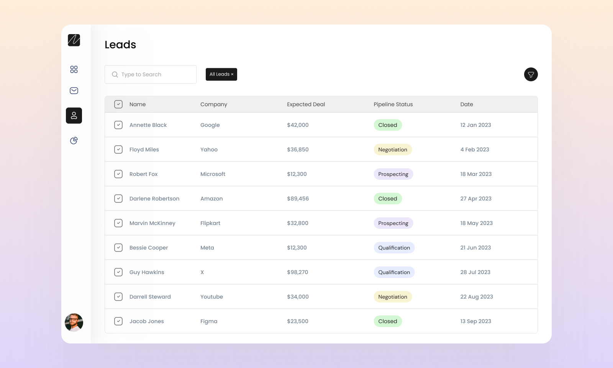

# {{ $frontmatter.title}}

<ChallengesBadges type="html" />
<ChallengesBadges type="css" />

Это задание поможет вам попрактиковаться в использовании семантических тегов. Подумайте, какие элементы лучше всего подходят для разметки каждой части страницы.

### Макет

[Макет в Figma](https://www.figma.com/community/file/1301206145572420646/table-responsiveness) (Table Responsiveness)  

## 📝 Задача

В этом задании вам необходимо реализовать адаптивную вёрстку таблицы, обеспечив корректное отображение данных на трёх ключевых разрешениях: 1280px, 1440px и 1920px. Важно соблюсти точность макета и настроить гибкое изменение ширины колонок для сохранения читаемости контента в каждом вьюпорте.

## 💡 Идеи для практики

1. Уделите особое внимание семантике: выбирайте HTML-элементы, которые лучше всего передают смысл контента.
2. Постарайтесь проявить внимание к деталям, чтобы итоговый результат максимально соответствовал макету.

## 🤔 FAQ

<ChallengesAccordion />
