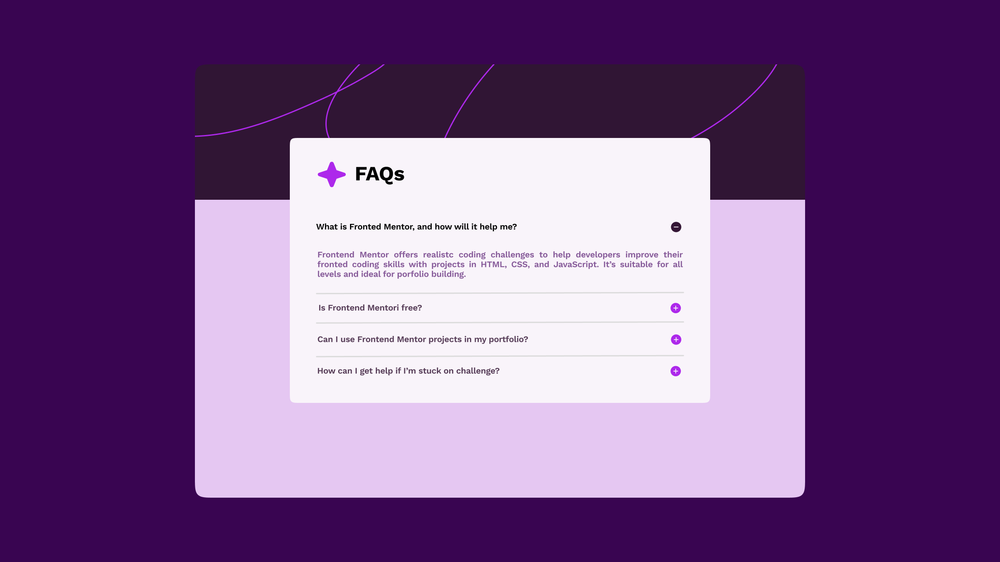

# {{ $frontmatter.title }}

<ChallengesBadges :types="['html', 'css', 'js']" />

Аккордеон — это классический элемент интерфейса, используемый для компактного размещения большого объема текстовой информации. Основная задача данного челленджа — проработка логики переключения состояний и создание качественной анимации разворачивания контента.

Этот компонент научит вас работать с состояниями элементов, доступностью (A11Y) и управлением высотой блоков в CSS.

## 📝 Задача

Вам необходимо сверстать виджет **Часто задаваемых вопросов (FAQ)**. Список должен состоять из нескольких пунктов, где при клике на заголовок открывается скрытый текст ответа.

**Технические требования:**

- Реализовать открытие/закрытие секций (одновременное или по отдельности).
- Добавить визуальные индикаторы состояния (например, поворот иконки стрелки).
- Обеспечить корректное отображение текстового контента внутри выпадающих панелей.

### Макет

[Макет в Figma](https://www.figma.com/community/file/1314733281691503679/faq-accordion) (FAQ accordion)

## 💡 Идеи для практики

1. Вы можете использовать **любые технологии** для выполнения задания: нативный JavaScript, современные CSS-фреймворки (Tailwind), препроцессоры (Sass/Less) или UI-библиотеки (React, Vue).
2. Помните, что «пиксель-перфект» не является обязательным требованием, но приветствуется. Вы имеете полное право на **творческие эксперименты** в оформлении и анимациях.
3. Попробуйте реализовать задачу с использованием семантичного тега `
` и `
` или через управление атрибутами `aria-expanded` для улучшения доступности.

## 🤔 FAQ

<ChallengesAccordion />
