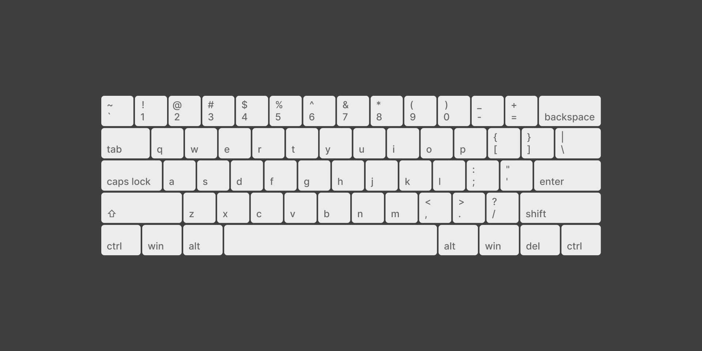

# {{ $frontmatter.title}}

<ChallengesBadges :types="['html', 'css']" />

Создание клавиатуры — это идеальный способ понять, как ведут себя элементы с разной шириной в рамках одной сетки. 

Это отличная практика, чтобы перестать бояться сложных макетов и научиться комбинировать современные инструменты верстки.

### Макет

[Макет в Figma](https://www.figma.com/community/file/1298637835669954280/simple-pc-keyboard-layout) (Simple PC Keyboard Layout) 

## 📝 Задача

Ваша цель — реализовать визуальную модель компьютерной клавиатуры.

* Используйте **HTML-теги**, которые лучше всего подходят для кнопок.
* Примените **CSS Grid** для построения основной сетки (рядов и клавиш).
* Используйте **Flexbox** для выравнивания символов (букв и цифр) внутри самих клавиш.
* Не забудьте про специфические клавиши: `Space`, `Shift`, `Enter` и `Caps Lock` должны быть шире стандартных.

## 💡 Идеи для практики

1. **Сетки и пропорции:** Попробуйте задать разную ширину колонок в Grid, чтобы "длинные" клавиши встали на свои места без костылей.
2. **Внимание к деталям:** Используйте `border-radius` и небольшие тени (`box-shadow`), чтобы придать кнопкам объем.
3. **Цветовая палитра:** Выделите функциональные клавиши (Esc, Enter, Arrows) другим цветом, чтобы улучшить читаемость интерфейса.

## 🤔 FAQ

<ChallengesAccordion />