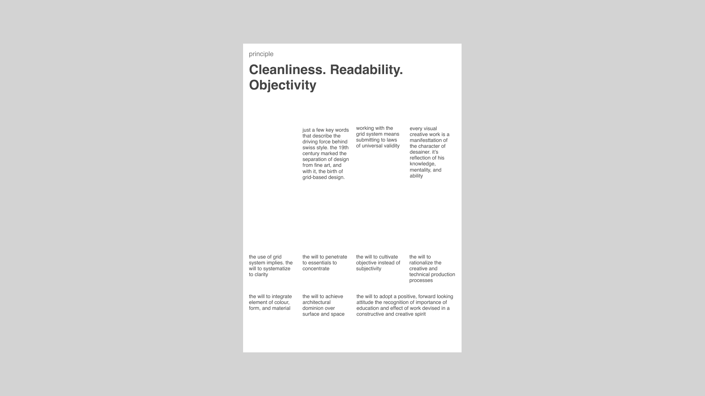

# {{ $frontmatter.title}}

<ChallengesBadges :types="['html', 'css']" />

До появления CSS Grid создание многоколоночных газетных макетов было настоящей головной болью для разработчиков. Сегодня же это отличный способ научиться управлять пространством и выравниванием.

В этом задании вы примерите на себя роль верстальщика печатного издания и узнаете, как легко строить сложные структуры.

### Макет

[Макет в Figma](https://www.figma.com/community/file/1085175788124420703/design-history-swiss-design) (Design History: Swiss Design)

## 📝 Задача

Ваша задача — создать страницу газеты, которая включает в себя заголовок и несколько колонок с текстом разной ширины.

**Технические требования:**

- **Семантика:** Используйте теги `<header>`, `<main>`, `<article>`, `<section>` и `<footer>`.
- **CSS Grid:** Постройте общую сетку страницы.
- **Многоколоночность:** Для длинных текстовых блоков внутри статей попробуйте свойство `column-count`.
- **Адаптивность:** Сделайте так, чтобы на узких экранах (мобильных) колонки выстраивались друг под другом.

## 🤔 FAQ

<ChallengesAccordion />
