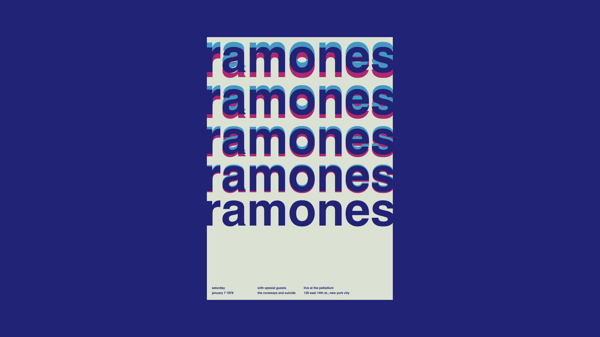

# {{ $frontmatter.title}}

<ChallengesBadges :types="['html', 'css']" />

Швейцарский стиль — это про порядок, объективность и читаемость. В его основе лежит модульная сетка, которая позволяет гармонично сочетать крупные заголовки, мелкий текст и изображения.

Это задание поможет вам почувствовать "ритм" страницы и научит располагать элементы в сетке так, чтобы они выглядели профессионально, даже если их немного.

### Референсы

Для вдохновения изучите работы Йозефа Мюллер-Брокманна или Вима Краувела. Основные черты: шрифт без засечек (Helvetica/Arial), сильная иерархия и много свободного пространства.

### Макет

[Макет в Figma](https://www.figma.com/community/file/1085175788124420703/design-history-swiss-design) (Design History: Swiss Design)

## 📝 Задача

Ваша задача — сверстать постер, используя **CSS Grid**. Макет должен состоять из четких колонок и рядов, где элементы могут занимать сразу несколько ячеек.

## 💡 Идеи для практики

1. Уделите особое внимание семантике: выбирайте HTML-элементы, которые лучше всего передают смысл контента (заголовки, секции, подписи).
2. Вы можете использовать **любые технологии** для выполнения задания: препроцессоры (Sass/Less), CSS-фреймворки (Tailwind) или методологию БЭМ.
3. Помните, что «пиксель-перфект» не является обязательным требованием, но приветствуется. Вы имеете полное право на **творческие эксперименты** в рамках стиля.
4. Попробуйте создать модульную сетку и разместить элементы так, чтобы они занимали разные области (`grid-column` и `grid-row`).

## 🤔 FAQ

<ChallengesAccordion />
