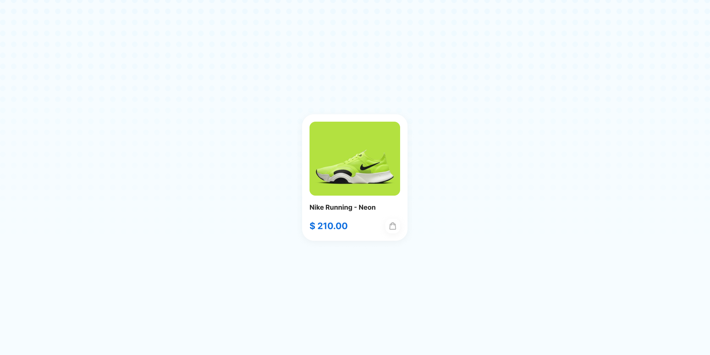

# {{ $frontmatter.title }}

<ChallengesBadges :types="['html', 'css']" />

Карточка товара — это базовый кирпичик любого интернет-магазина. Этот челлендж поможет новичкам закрепить навыки построения блочной модели, работы с изображениями и выравнивания элементов по сетке.

Основной упор в данном задании сделан на аккуратность: важно соблюсти баланс между внутренними отступами и грамотно оформить акцентный блок с фотографией.

## 📝 Задача

Вам необходимо реализовать карточку кроссовок **Nike Running - Neon**. Виджет состоит из контейнера с мягкой тенью, яркой подложки для фотографии и текстового блока с ценой.

### Макет

[Макет в Figma](https://www.figma.com/community/file/1226088275750346932/product-card-hover-interaction) (Product Card - Hover Interaction)

## 💡 Идеи для практики

1.  Используйте **Flexbox** для того, чтобы цена и кнопка покупки (иконка корзины) находились на одной линии и были прижаты к разным краям.
2.  Поработайте со скруглениями (`border-radius`): обратите внимание, что углы внешней карточки и внутреннего блока с фото могут отличаться.
3.  Попробуйте добавить простые **микровзаимодействия**: например, небольшое приподнимание карточки при наведении (`transform: translateY`) или изменение прозрачности иконки.
4.  Экспериментируйте с тенями (`box-shadow`), чтобы добиться эффекта «парения» карточки над фоном, как в оригинале.

## 🤔 FAQ

<ChallengesAccordion />