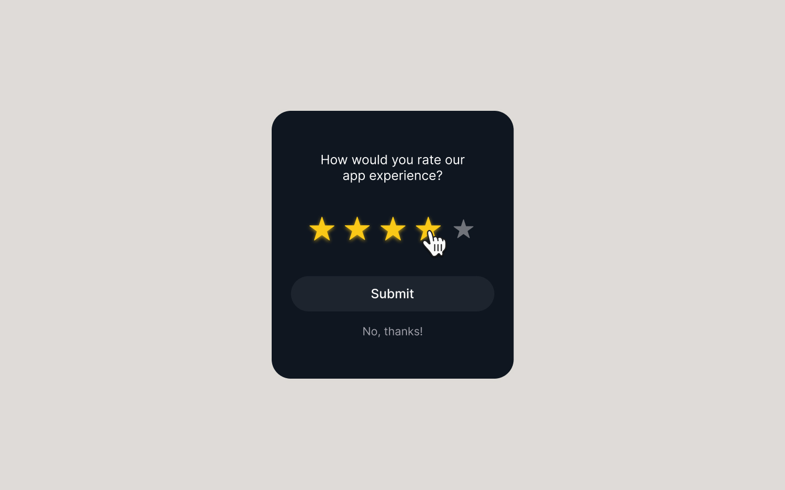

# {{ $frontmatter.title }}

<ChallengesBadges :types="['html', 'css', 'js']" />

Виджет рейтинга — это классическая задача на манипуляцию DOM-деревом и обработку событий. Основная сложность здесь заключается не столько в вёрстке, сколько в реализации логики: звёзды должны динамически подсвечиваться при наведении и фиксировать своё состояние после клика.

Этот челлендж поможет вам закрепить навыки работы с событиями мыши (`mouseenter`, `mouseleave`, `click`), делегированием событий и управлением классами в CSS.

## 📝 Задача

Вам необходимо реализовать компактный виджет обратной связи. Пользователь должен иметь возможность выбрать оценку от 1 до 5 звёзд, после чего нажать кнопку «Submit».

### Макет

[Макет в Figma](https://www.figma.com/community/file/1365299058659426203/star-rating-animation) (Star Rating Animation)

## 💡 Идеи для практики

1.  **Логика наведения:** Реализуйте «умную» подсветку: при наведении на третью звезду должны подсвечиваться первая, вторая и третья. При уходе курсора (если выбор не сделан) звёзды должны возвращаться в исходное состояние.
2.  **Доступность (A11Y):** Попробуйте сделать виджет доступным для управления с клавиатуры. Хорошей практикой считается использование скрытых `input type="radio"` для каждой звезды.
3.  **Состояние после отправки:** Добавьте простую анимацию или экран «Спасибо за отзыв\!» после нажатия на кнопку отправки, чтобы сделать интерфейс более живым.

## 🤔 FAQ

<ChallengesAccordion />
