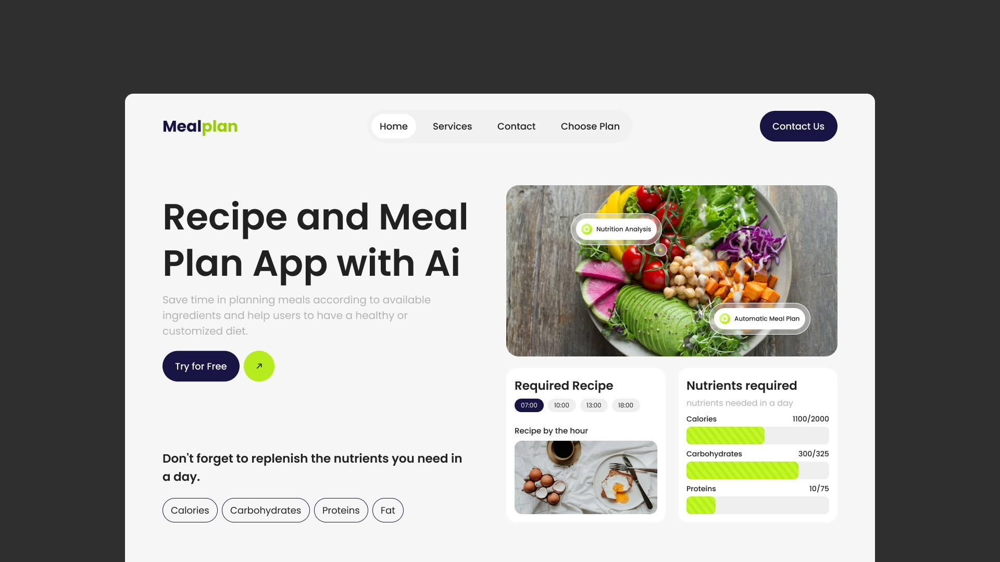

# {{ $frontmatter.title }}

<ChallengesBadges :types="['html', 'css']" />

Создание лендинга — это отличный способ отработать навыки построения структуры страницы и позиционирования элементов. В этом челлендже вам предстоит сверстать несколько секций для современного сервиса, который использует искусственный интеллект для составления персонального меню.

Задание ориентировано на новичков: основной упор сделан на работу с Flexbox или Grid Layout, типографику и корректное отображение контента на разных экранах.

## 📝 Задача

Вам необходимо реализовать небольшую посадочную страницу (2-3 секции), состоящую из:

1. **Шапки (Header)** с логотипом и простой навигацией.
2. **Главного экрана (Hero)** с заголовком, призывом к действию (CTA) и тематическим изображением.
3. **Секции преимуществ или «Как это работает»**, где кратко описаны возможности ИИ в кулинарии.

Верстка должна быть аккуратной и логичной.

### Макет

[Макет в Figma](https://www.figma.com/community/file/1422583998584487205/website-landing-page-recipe-and-meal-plan-with-ai) (Website Landing Page Recipe and Meal Plan with Ai)

## 💡 Идеи для практики

1. Используйте **семантические теги** (`<header>`, `<main>`, `<section>`, `<footer>`), чтобы сделать код понятным для поисковиков и скринридеров.
2. Попробуйте реализовать **адаптивность** без использования тяжелых фреймворков — только чистый CSS и медиа-запросы (`@media`).
3. Уделите внимание **состояниям элементов**: добавьте плавные переходы (`transition`) для кнопок и ссылок при наведении курсора.
4. Экспериментируйте с современными CSS-свойствами, например, `aspect-ratio` для изображений блюд или `gap` для отступов в сетке.

## 🤔 FAQ

<ChallengesAccordion />
