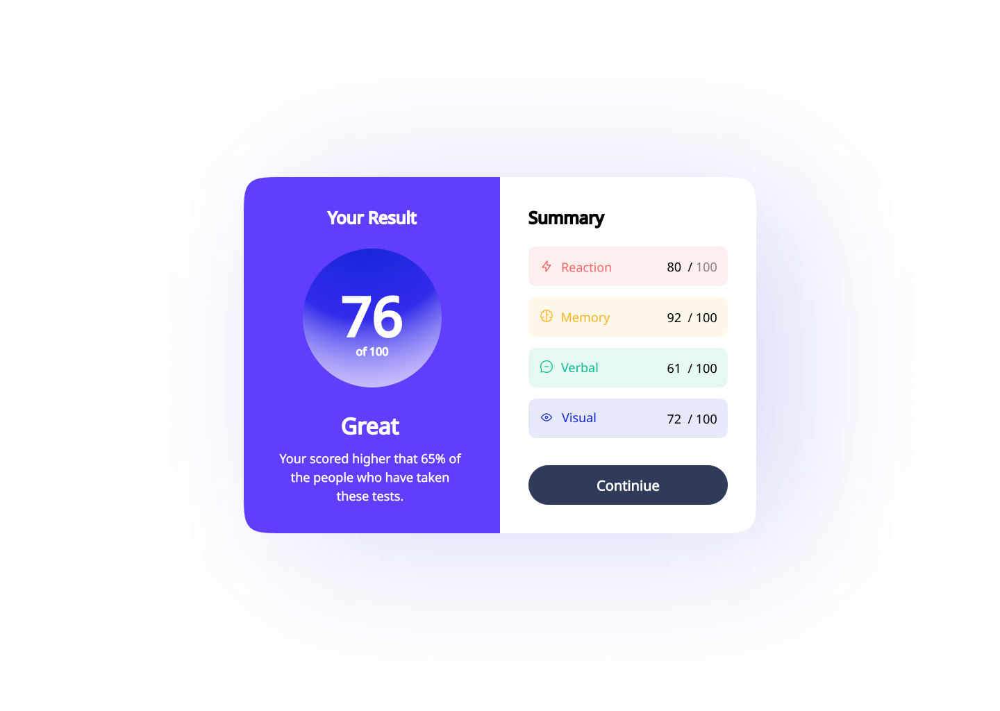

# {{ $frontmatter.title }}

<ChallengesBadges :types="['html', 'css', 'js']" />

Этот компонент — классический пример интерфейса для образовательных платформ и дашбордов. Основная задача челленджа заключается в работе с композицией блоков, сложными градиентами и оформлением списков с различными цветовыми акцентами.

Вы научитесь создавать двухпанельные макеты, которые корректно перестраиваются под мобильные устройства, и работать с кастомными стилями для каждого элемента статистики.



## 📝 Задача

Вам необходимо сверстать карточку **Результатов теста (Results Summary)**. Левая часть содержит общий балл и оценку, правая — детализацию по категориям (реакция, память, вербальные и визуальные навыки).

### Макет

[Макет в Figma](https://www.figma.com/community/file/1387535048607300291/results-summary-component) (results-summary-component)

## 💡 Идеи для практики

1.  **Семантика и доступность**: Используйте правильные заголовки и списки. Убедитесь, что цветовой контраст соответствует стандартам доступности (A11Y).
2.  **Работа с JSON**: Для тех, кто хочет попрактиковаться в JavaScript, попробуйте не хардкодить данные в HTML, а подгружать их из отдельного файла `data.json` и рендерить список динамически.

```json
[
  {
    "category": "Reaction",
    "score": 80,
    "icon": "./assets/images/icon-reaction.svg",
    "color": "hsl(0, 100%, 67%)"
  },
  {
    "category": "Memory",
    "score": 92,
    "icon": "./assets/images/icon-memory.svg",
    "color": "hsl(39, 100%, 56%)"
  },
  {
    "category": "Verbal",
    "score": 61,
    "icon": "./assets/images/icon-verbal.svg",
    "color": "hsl(166, 100%, 37%)"
  },
  {
    "category": "Visual",
    "score": 73,
    "icon": "./assets/images/icon-visual.svg",
    "color": "hsl(234, 85%, 45%)"
  }
]
```

3.  **Современный CSS**: Используйте CSS-переменные для управления цветами категорий. Это позволит легко менять палитру в одном месте, не переписывая все стили.

## 🤔 FAQ

<ChallengesAccordion />
