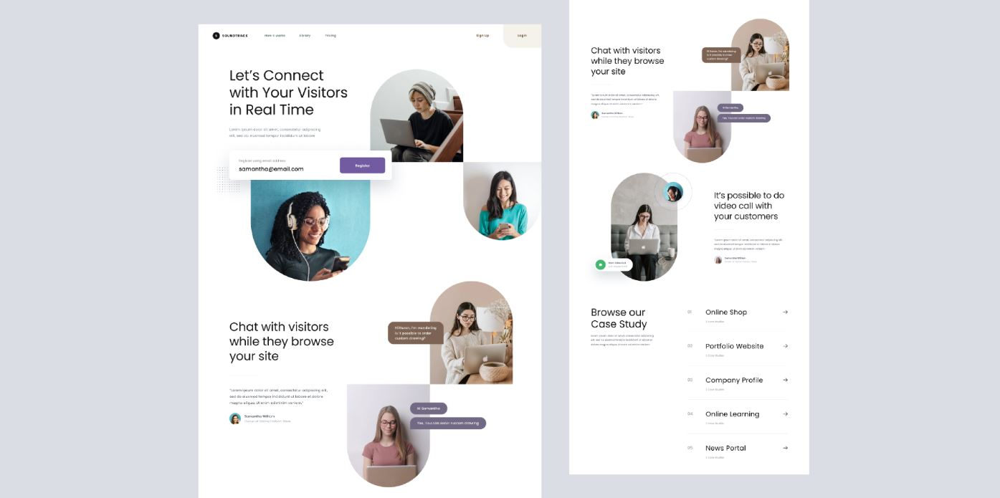

# {{ $frontmatter.title }}

<ChallengesBadges :types="['html', 'css']" />

Создание современных лендингов требует не только владения базовыми инструментами верстки, но и умения работать со сложными композициями. В этом задании основной фокус направлен на реализацию многослойной сетки, использование CSS-масок для изображений и соблюдение баланса «воздуха» в интерфейсе.

Этот проект поможет вам закрепить навыки позиционирования элементов, работы с Flexbox или Grid, а также создания отзывчивой типографики.

## 📝 Задача

Вам необходимо реализовать главную страницу, состоящую из трёх ключевых секций:

1.  **Hero-секция:** заголовок, форма регистрации и композиция из изображений в форме арок и кругов.
2.  **Информационный блок:** текстовый контент с цитатой клиента и декоративными элементами чата.
3.  **Кейсы (Case Studies):** список проектов с акцентом на типографику и аккуратные разделители.

### Макет

[Макет в Figma](https://www.figma.com/community/file/976775550989488272/website-landing-page) (Website Landing Page)

## 💡 Идеи для практики

1.  **CSS Shapes и Masks:** Попробуйте реализовать скругления изображений не просто через `border-radius`, а используя свойства `clip-path` или `mask-image` для достижения идеальной формы «арки».
2.  **Сложные сетки:** Используйте **CSS Grid** для наложения элементов друг на друга (например, формы на изображение в Hero-секции), это гораздо чище, чем манипуляции с отрицательными отступами.
3.  **Адаптивность:** Подумайте, как трансформировать многослойную композицию из изображений для мобильных устройств, чтобы сохранить читаемость текста и удобство использования формы.

## 🤔 FAQ

<ChallengesAccordion />
