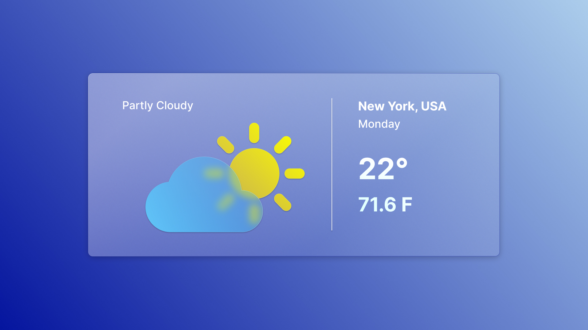

# {{ $frontmatter.title}}

<ChallengesBadges :types="['html', 'css']" />

Это задание поможет вам попрактиковаться в использовании семантических тегов. Подумайте, какие элементы лучше всего подходят для разметки каждой части страницы.

### Макет

[Макет в Figma](https://www.figma.com/community/file/1117178321189746254/weather-widget) (Weather Widget)  

## 📝 Задача

Ваша задача — реализовать погодный виджет, максимально придерживаясь представленного макета.
В выборе стека ограничений нет: используйте любые инструменты, которые вам удобны. Это отличная возможность попрактиковаться в новых технологиях, так что не бойтесь экспериментировать!

## 💡 Идеи для практики

1. Уделите особое внимание семантике: выбирайте HTML-элементы, которые лучше всего передают смысл контента.
2. Постарайтесь проявить внимание к деталям, чтобы итоговый результат максимально соответствовал макету.

## 🤔 FAQ

<ChallengesAccordion />
