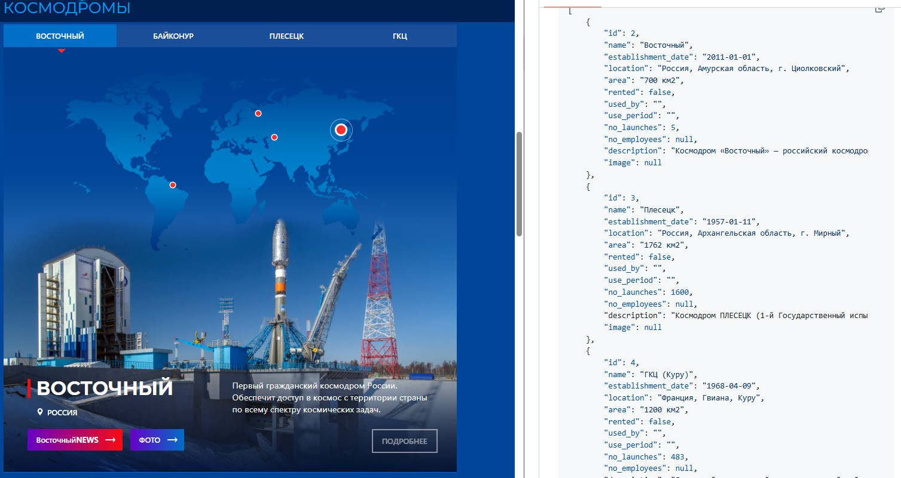

# {{ $frontmatter.title}}

<ModernJsMeta :level="$frontmatter.level" :theme="$frontmatter.theme"/>

Прежде чем приступить к созданию сервера, давайте разберёмся с основами RESTful API — ключевого элемента взаимодействия между фронтендом и бэкендом.

## Что такое API?

**API (Application Programming Interface)** — это способ, с помощью которого два компьютера обмениваются данными. Представьте, что вы заходите на сайт в браузере: кликаете кнопки, заполняете формы, видите контент. API работает похожим образом, но вместо действий мышкой вы пишете код, который **явно запрашивает данные** у сервера.

Например:  
Вы можете зайти на сайт [Роскосмоса](https://www.roscosmos.ru/#kosmodrom) и посмотреть список космодромов.  
А можете использовать **REST API**, чтобы получить те же данные в виде «сырого» JSON — структурированного формата, удобного для программной обработки.



## Что такое RESTful API?

Большинство современных API — **RESTful**. Это означает, что они следуют определённому набору правил, называемых **Representational State Transfer (REST)**.  
Этот подход стал стандартом для создания веб-API с начала 2000-х годов.

### Как устроен RESTful API?

REST организует данные на сервере в виде **ресурсов**, каждый из которых имеет уникальный адрес.

Технически это не просто URL, а **URI (Uniform Resource Identifier)** — уникальный идентификатор ресурса.

Примеры URI:
- `/users` — список пользователей
- `/users/123` — конкретный пользователь с ID 123
- `/images` — список изображений

Клиент (например, ваш браузер или фронтенд) получает данные, отправляя **HTTP-запрос** к такому URI.

## Структура HTTP-запроса

HTTP-запрос имеет строгий формат. Вот его основные части:

### 1. Стартовая строка
Состоит из:
- **HTTP-метода (глагола)** — указывает, что вы хотите сделать с ресурсом.
- **URI** — адрес ресурса.

Наиболее используемые HTTP-методы:
- `GET` — получить данные (например, прочитать список изображений).
- `POST` — создать новый ресурс (например, отправить текст для генерации изображения).
- `PUT` / `PATCH` — обновить существующий ресурс.
- `DELETE` — удалить ресурс.

### 2. Заголовки (Headers)
Содержат **метаданные** о запросе. Например:
- `Accept: application/json` — говорит серверу, что вы ожидаете данные в формате JSON.
- `Authorization: Bearer <ваш_ключ>` — передаёт токен доступа, подтверждающий вашу личность.
- `Content-Type: application/json` — указывает, что тело запроса содержит JSON.

### 3. Тело запроса (Body)
Содержит данные, которые вы хотите отправить.  
Например, при генерации изображения тело может выглядеть так:
```json
{
  "prompt": "космический корабль в облаках"
}
```


## Ответ сервера

Сервер получает запрос, выполняет нужные действия (например, обращается к базе данных или внешнему API), а затем отправляет **ответ**.

Структура ответа:
1. **Статус-код** — число, указывающее результат операции:
   - **2xx** (например, 200) — успех.
   - **4xx** (например, 404, 401) — ошибка на стороне клиента (неверный запрос, нет доступа).
   - **5xx** (например, 500) — ошибка на стороне сервера.

2. **Заголовки ответа** — информация о сервере, формате данных и т.д.

3. **Тело ответа** — сами данные, чаще всего в формате **JSON**.  
   Например:
   ```json
   {
     "imageUrl": "https://example.com/generated-image.png"
   }
   ```

## Stateless-архитектура

Важная особенность: REST — это **stateless** (без сохранения состояния) архитектура.  
Это значит:
- Сервер **не хранит информацию** о предыдущих запросах.
- Каждый запрос должен быть **самодостаточным** — содержать всю необходимую информацию (например, авторизационный токен).
- Все запросы независимы друг от друга.

Такой подход делает веб-приложения **предсказуемыми, надёжными и масштабируемыми**.

## Итог

RESTful API — это стандартный способ организации взаимодействия между клиентом и сервером.  

**Он использует:**
- Уникальные URI для ресурсов
- HTTP-методы для действий (GET, POST и т.д.)
- Заголовки и тело для передачи данных
- JSON для обмена информацией
- Статус-коды для определения результата

Теперь, когда вы понимаете, как устроены API, в следующем уроке мы создадим свой собственный сервер на Node.js и реализуем первый endpoint.