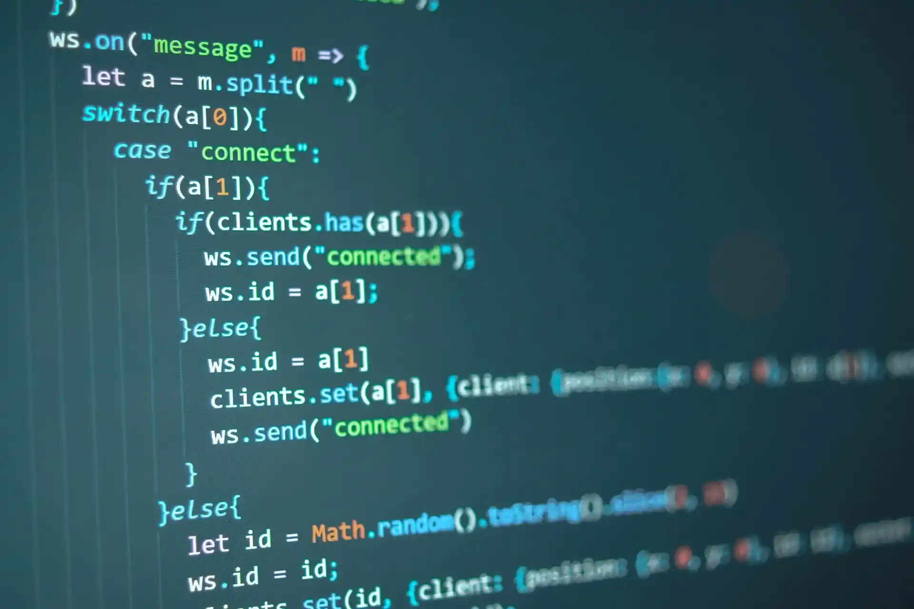

# {{ $frontmatter.title}}

<ArticleMeta :author="$frontmatter.author" :source="$frontmatter.source"/>



Когда я впервые решил научиться программировать, сама мысль о том, что мне нужно выбрать язык для изучения, пугала. Я ничего не знал об этой сфере, и не было никого, кого бы я знал и кому доверял. Из-за этого выбор казался невероятно сложным. Настолько сложным, что я провел половину 2017 года и большую часть 2018 года, переходя от одного ресурса к другому, в поисках «правильного» места, где можно выучить «правильный» язык. Я смотрел на Python, JavaScript, Ruby, проходил бесплатные курсы, платные курсы, пробовал книги. Полтора года! И я хочу поделиться тем, чему я научился за это время блужданий:

_почти ничему_

(ну, честно, я узнал, что такое переменная и функция. Самые базовые вещи. Но попросите того меня, бродягу, написать простую игру «камень, ножницы, бумага»? Тогда только тихо рыдать.gif)

Оглядываясь назад, я теперь лучше понимаю, почему я не рос в тот период. Искренне не думаю, что виной тому были ресурсы, которые я использовал. На самом деле, я считаю, что любой достаточно мотивированный человек может научиться где угодно. Ведь самостоятельное обучение — это и есть суть процесса! (Ну, почти. У меня есть и другие мысли, но это уже история на другой день.)

Я думаю, что главной проблемой была моя нерешительность и страх, что я выбрал не тот язык. Эта мысль преследовала меня каждую ночь, и я был в ужасе, что учусь не тому. А вдруг к тому времени, как я что-то выучу, Python уже исчезнет? А вдруг всех, кто потратил время на изучение JavaScript, массово уволят? А вдруг весь мир откажется от Ruby? А вдруг ИИ захватит всё!?

Я уже не помню, как пришла ко мне следующая мысль (возможно, это было видео на YouTube, или комментарий на Reddit, а может, даже ангел-хранитель), но я услышал совет: **важно не столько выучить конкретный язык программирования, сколько научиться программировать**. Однако моё мышление не изменилось мгновенно. Я продолжал переживать ещё месяцы.

В конце концов я вернулся к The Odin Project. На самом деле, это был один из первых ресурсов, которые я пробовал, но сначала он меня отпугнул своей глубиной. Но в этот раз я пообещал себе, что не сдамся. И я не сдался. И я думаю, что за первые несколько месяцев я узнал там больше, чем за всё время своих блужданий. Сначала я начал с Ruby, а в марте 2020 года сменил фокус на JavaScript. Этот переход подтвердил ту самую мысль: важнее научиться программировать, чем выучить язык. Мне не нужно было снова учиться программировать с нуля. Я уже знал, что такое переменные, циклы, функции. Оставалось лишь разобраться, как это делается в JavaScript.

Буду честен: первые несколько недель работы с JavaScript вызывали тревогу. Но Бриггс, модератор The Odin Project, напомнил мне, что нужно воспринимать задачу как проблему программирования, а не проблему JavaScript. Так что в начале перехода я сначала думал, как бы я решил задачу на Ruby, писал псевдокод, а затем размышлял, как реализовать это с помощью возможностей, которые даёт JavaScript.

Приведу аналогию:

Пит любит велосипеды. Пит также мечтает однажды научиться водить машину. Но велосипед ему кажется безопасным и привычным. Однажды его друг Кларисса приглашает Пита поучиться водить. Главная тревога Пита — он боится, что не сможет повернуть руль в машине Клариссы. Но Кларисса напоминает ему, что он уже понимает основы, ведь он умеет поворачивать на велосипеде. То, как он справился с первым уроком, не так важно. Важно то, что он подошёл к занятию с уверенностью, потому что он уже знал, как заставить транспортное средство менять направление. Именно базовое понимание помогло Питу сделать этот переход.

То же самое и с языками программирования. Посмотрите:

Вывод строки `«Hello World!»` на Ruby:

```Ruby
def say_hi
puts "Hello World!"
end
say_hi
```

На JavaScript:

```JavaScript
function sayHi() {
console.log("Hello World!");
}
sayHi();
```

В обоих случаях мы увидим: `Hello World!`

А что, если мы хотим выбрать первый элемент массива?

Допустим, у нас есть массив `animals`:

```
animals = ['дельфин', 'корова', 'панголин', 'кошка', 'курица', 'коза']
```

На Ruby мы напишем:

```Ruby
animals[0]
```

На JavaScript:

```JavaScript
animals[0]
```

И в обоих случаях получим: дельфин!

А что, если мы хотим пройтись по массиву animals? То есть вывести каждый элемент.

```
animals = ['дельфин', 'корова', 'панголин', 'кошка', 'курица', 'коза']
```

На Ruby:

```Ruby
animals.each { |animal| puts animal }
```

На JavaScript:

```JavaScript
animals.forEach(animal => console.log(animal));
```

Оба варианта выведут:

```
дельфин
корова
панголин
кошка
курица
коза
```

Некоторые из фундаментальных концепций, которые мы использовали в примерах выше:

- определение функции
- вызов функции
- вывод результата функции
- доступ к элементу массива
- перебор всех элементов массива

Самое крутое — все эти базовые вещи можно сделать не только на Ruby и JavaScript, но и на многих других языках. Быстрый поиск в Яндексе покажет, [как получить элемент массива в Python](https://ya.ru/search/?text=%D0%BA%D0%B0%D0%BA+%D0%BF%D0%BE%D0%BB%D1%83%D1%87%D0%B8%D1%82%D1%8C+%D1%8D%D0%BB%D0%B5%D0%BC%D0%B5%D0%BD%D1%82+%D0%BC%D0%B0%D1%81%D1%81%D0%B8%D0%B2%D0%B0+%D0%B2+Python&lr=21&search_source=yaru_desktop_common&search_domain=yaru). Можно найти, [как определить функцию в Rust](https://ya.ru/search/?text=%D0%BA%D0%B0%D0%BA+%D0%BE%D0%BF%D1%80%D0%B5%D0%B4%D0%B5%D0%BB%D0%B8%D1%82%D1%8C+%D1%84%D1%83%D0%BD%D0%BA%D1%86%D0%B8%D1%8E+%D0%B2+Rust&lr=21). Понимание этих фундаментальных концепций сделает изучение их в новом языке гораздо проще, чем когда вы впервые сталкивались с ними.

Когда вы ищете «правильный» язык, **вы можете испортить свою карьеру, если позволите нерешительности поглотить столько энергии, что обучение так и не начнётся**. Как только вы заложите прочный фундамент на каком-то одном языке, изучение нового языка окажется гораздо легче, чем изучение первого.

Но, конечно, одного этого осознания может быть недостаточно, чтобы сделать выбор легко. Вот несколько моментов, которые помогут вам определиться:

- Какие языки чаще всего упоминаются в вакансиях в регионе, где вы хотите работать?
- Есть ли сообщество учащихся, которое вы могли бы присоединиться, чтобы изучать язык, который вы определили в первом вопросе? По моему личному мнению, этот пункт должен быть важнее первого. Учиться в сообществе намного лучше, чем в одиночку. И если вы хорошо выучите свой первый язык, вы всегда сможете позже освоить тот, что указан в вакансиях.

Вы станете лучше программистом быстрее, если начнёте учиться уже сегодня.
