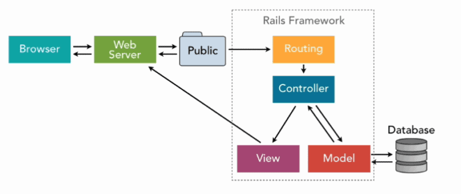
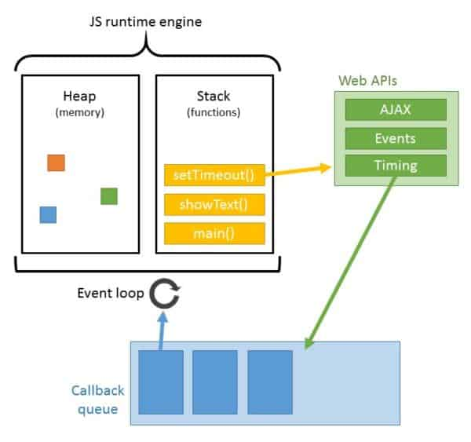
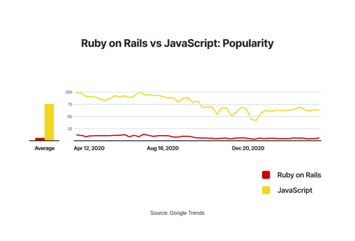

# {{ $frontmatter.title}}

<ArticleMeta :author="$frontmatter.author" :source="$frontmatter.source"/>

Сравнение Ruby on Rails и JavaScript является одной из самых популярных тем для дискуссий в сообществе веб-разработчиков. Если Ruby on Rails (RoR) представляет собой серверный фреймворк для разработки веб-приложений, то JavaScript изначально является языком программирования, выполняемым на стороне клиента (в браузере). Таким образом, эти технологии легко можно использовать вместе в одном технологическом стеке. Однако со временем JavaScript значительно эволюционировал и превратился в полноценный универсальный язык программирования. Сегодня с помощью чистого JavaScript и различных библиотек на его основе можно создавать полноценные веб-приложения «с нуля» как на клиенте, так и на сервере.

Именно поэтому мы решили провести сравнительный анализ преимуществ и недостатков этих технологий при разработке веб-приложений.

Давайте подробнее рассмотрим Ruby on Rails и JavaScript, выявим ключевые различия между ними и сравним их возможности для веб-разработки.

## Что такое Ruby on Rails

**Ruby on Rails** (также известный как RoR) — это фреймворк на основе языка программирования Ruby, предназначенный для разработки серверных веб- и десктоп-приложений. Он разработан с учётом гибкости и может быть адаптирован под конкретные потребности пользователей. Фреймворк предоставляет шаблон или структуру с базовыми функциями, которые можно добавлять на веб-страницы. Разработчик может использовать этот шаблон как основу для создания нужного приложения.

Сам по себе Ruby — это открытый язык программирования, основанный на концепциях объектно-ориентированного программирования. Ruby on Rails использует архитектуру **MVC (Model-View-Controller)**:

- **Модель (Model)** — хранит данные и логику доступа к ним.
- **Представление (View)** — отвечает за отображение информации пользователю.
- **Контроллер (Controller)** — выступает в роли посредника, управляя взаимодействием между моделью и представлением.

Среда выполнения Ruby on Rails работает на интерпретаторе и поддерживается встроенными скриптами, программами и обширными библиотеками.

## Преимущества Ruby on Rails

1. **Удобство для разработчиков**  
   Ruby on Rails предоставляет готовый каркас для веб-проектов, что упрощает начало разработки. Его синтаксис понятен и легко читаем, что облегчает реализацию и поддержку кода. Это позволяет разработчикам сосредоточиться на функциональных возможностях приложения, а не на рутинных задачах.

2. **Поддержка сообщества**  
   Ruby — это язык с открытым исходным кодом, который постоянно развивается благодаря большому сообществу разработчиков. Сообщества активно обсуждают ключевые темы, публикуют статьи и находят решения проблем.

3. **Удобство для систем управления контентом (CMS)**  
   Благодаря архитектуре MVC, создание и управление контентом (добавление, просмотр, загрузка, публикация) становится проще. Это делает Ruby on Rails отличным выбором для разработки CMS.

4. **Совместимость с фронтенд-фреймворками**  
   Ruby on Rails хорошо интегрируется с популярными фронтенд-решениями, такими как **Angular.js**, **React.js** и **Vue.js**. Это снижает трудозатраты на разработку и позволяет повторно использовать компоненты.

5. **Следование отраслевым стандартам**  
   Ruby on Rails придерживается лучших практик разработки программного обеспечения, таких как:

   - **Convention over Configuration (CoC)** — «Соглашения вместо конфигурации».
   - **DRY (Don’t Repeat Yourself)** — «Не повторяйся».

   Эти подходы способствуют созданию чистого, переиспользуемого и легко поддерживаемого кода. Архитектура MVC помогает эффективно реализовывать даже сложную логику.

6. **Другие преимущества**  
   К достоинствам также относятся: переносимость, простота, высокая эффективность разработки, повышенная производительность и расширяемость.

7. Области применения Ruby on Rails:

   - Интернет-магазины (e-commerce)
   - Сложные программные решения
   - Платформы для развлечений и медиа

## Недостатки Ruby on Rails

1. **Недостаток гибкости**  
   Ruby on Rails не очень подходит для задач с высокой сложностью и большим количеством деталей. Он оптимизирован для типовых приложений, а не для проектов с нестандартной или сложной логикой.

2. **Быстрое развитие и необходимость обновлений**  
   Фреймворк активно развивается благодаря поддержке сообщества. Однако это может быть и минусом: приложения необходимо регулярно обновлять, чтобы использовать новые функции и обеспечивать безопасность.

3. **Время запуска и производительность**  
   Ruby on Rails имеет более длительное время запуска по сравнению с другими фреймворками. Это может создавать нагрузку в крупных проектах и влиять на производительность.

4. **Высокая цена ошибок**  
   Из-за особенностей архитектуры даже небольшая ошибка в коде может привести к серьёзным проблемам с производительностью или неожиданным сбоям в работе приложения. Разработчикам нужно быть особенно внимательными.

5. **Снижение популярности**  
   В последние годы интерес к Ruby on Rails среди разработчиков постепенно снижается, особенно на фоне роста популярности JavaScript и других современных технологий.

## Что такое JavaScript  

Следующим в нашей статье о сравнении Ruby on Rails и JavaScript — в чём разница — идёт JavaScript. Это популярный язык программирования среди веб-разработчиков. Это интерпретируемый язык с открытым исходным кодом, который может выполняться непосредственно в веб-браузерах. JavaScript используется вместе с CSS и HTML для реализации структуры веб-сайта. JavaScript широко применяется благодаря своей высокой функциональности, производительности и объектно-ориентированному поведению.

Внутренняя архитектура JavaScript приведена ниже.

## Преимущества JavaScript

1. **Скорость** — JavaScript требует меньше времени для выполнения по сравнению с другими языками программирования, поскольку является интерпретируемым языком. Высокая скорость выполнения очень полезна при клиент-серверном скриптинге.

2. **Простота изучения** — JavaScript имеет простую структуру, которая легко воспринимается. Поэтому использование JavaScript экономит время и является более гибким.

3. **Популярность** — сегодня JavaScript повсеместен, поскольку почти все браузеры его поддерживают. Поэтому такие авторитетные компании, как Amazon и Google, используют JavaScript как один из основных языков программирования.

4. **Способность к взаимодействию** — JavaScript легко взаимодействует с другими языками программирования. Его можно встраивать на любой веб-сайт, даже если он написан на другом языке программирования.

5. **Балансировка нагрузки** — JavaScript позволяет выполнять проверку данных в браузере без передачи на серверную сторону при использовании в клиентских приложениях. Это гораздо удобнее, так как достаточно обновить только нужный компонент веб-страницы, не перезагружая её полностью.

6. **Возможность разработки на полном стеке** — JavaScript можно использовать как для фронтенда, так и для бэкенда. Для фронтенда существуют основанные на JavaScript языки и библиотеки, такие как ReactJS и AngularJS, а для бэкенда — NodeJS.

7. **Расширенная поддержка разработки** — JavaScript предоставляет богатые интерфейсы для создания более привлекательных веб-страниц (слайдеры, drag and drop и т.д.), что помогает улучшить пользовательский опыт. Существуют различные дополнения для расширения функциональности JavaScript, такие как Greasemonkey, которые упрощают программирование на JavaScript.

8. **Снижение накладных расходов** — JavaScript повышает производительность веб-страниц за счёт более короткого кода и встроенных функций для доступа к DOM и других.

9. Области применения JavaScript:

    - веб-приложения, мобильные приложения и игры.

## Недостатки JavaScript

1. **Низкая безопасность** — база кода JavaScript может подвергаться атакам, поскольку пользователи могут просматривать его. Это позволяет хакерам вносить изменения в код и получать доступ к конфиденциальным данным со страницы.

2. **Отсутствие поддержки отладки** — в JavaScript нет эффективных средств отладки. Поэтому разработчикам трудно определить источник проблемы.

3. **Поведение в браузерах** — различные браузеры по-разному интерпретируют код JavaScript. Поэтому поведение кода необходимо тестировать и проверять на разных платформах и в разных версиях веб-браузеров перед запуском в эксплуатацию.

4. **Отсутствие поддержки множественного наследования** — JavaScript поддерживает только одиночное наследование. Это может быть недостатком в тех случаях, когда приложению требуется объектно-ориентированное поведение.

5. **Проблемы с отображением** — одна единственная ошибка в коде может остановить отображение всей веб-страницы. Однако современные браузеры улучшены и лучше справляются с такими проблемами.

## Различия между Ruby on Rails и JavaScript

1. **Скорость написания кода** — Ruby on Rails имеет множество дополнительных и мощных библиотек, которые поддерживают процесс разработки. С другой стороны, JavaScript обладает асинхронным поведением, при котором все коды выполняются одновременно. Он также предоставляет множество дополнительных функций.

2. **Производительность** — Ruby on Rails обеспечивает средний уровень производительности, поскольку не поддерживает асинхронное программирование. Кроме того, он требует высокого времени обработки на процессоре. JavaScript, в свою очередь, обладает более высокой производительностью благодаря поддержке асинхронных операций и событийно-ориентированной однопоточной архитектуре.

3. **Многопоточность** — Фреймворк Ruby on Rails способен обрабатывать несколько задач одновременно, поэтому поддерживает многопоточность, однако при выполнении сложных приложений возможны проблемы с производительностью. Интерпретатор JavaScript является однопоточным, поэтому сам JavaScript также не поддерживает многопоточность.

4. **Документация** — Ruby on Rails имеет исчерпывающую документацию и широкий спектр полезных функций, поддерживающих разработку. Документация по JavaScript является гораздо более сложной и продвинутой. Таким образом, она понятна в основном опытным разработчикам и требует много времени для изучения.

5. **Популярность** — JavaScript, без сомнения, чрезвычайно популярен среди разработчиков. Напротив, Ruby on Rails значительно менее популярен по сравнению с JavaScript.

6. **Простота изучения** — Ruby on Rails намного проще в изучении, даже для новичка, в то время как JavaScript может быть немного сложнее для освоения.

7. **Безопасность** — Ruby on Rails обеспечивает более высокий уровень безопасности, так как включает встроенные инструменты для защиты от различных киберугроз. Например, RoR поставляется с вспомогательными классами, предотвращающими SQL-инъекции и XSS-атаки. С другой стороны, JavaScript достаточно уязвим к XSS-атакам.

## Заключение: в чём разница между Ruby on Rails и JavaScript

JavaScript — это выразительный и практичный язык, который можно использовать как для фронтенда, так и для бэкенда. Ruby on Rails — один из самых популярных фреймворков сегодня, позволяющий быстро создавать потрясающие приложения.

Ruby on Rails используется для бэкенд-разработки, тогда как JavaScript применяется для фронтенд-разработки на стороне клиента. Однако JavaScript также может использоваться для бэкенд-разработки с помощью различных языков и фреймворков на его основе. Ruby on Rails включает компоненты на основе JavaScript (например, Hotwire), чтобы повысить удобство использования JavaScript вместе с Ruby on Rails. Кроме того, если вы используете Ruby и Rails для разработки, вам также потребуется применение других языков сценариев.

Определив основное назначение RoR и JavaScript, вы сможете правильно комбинировать их в своих приложениях. Поэтому тщательно проанализируйте требования к вашему приложению и внимательно выберите наилучший подход.