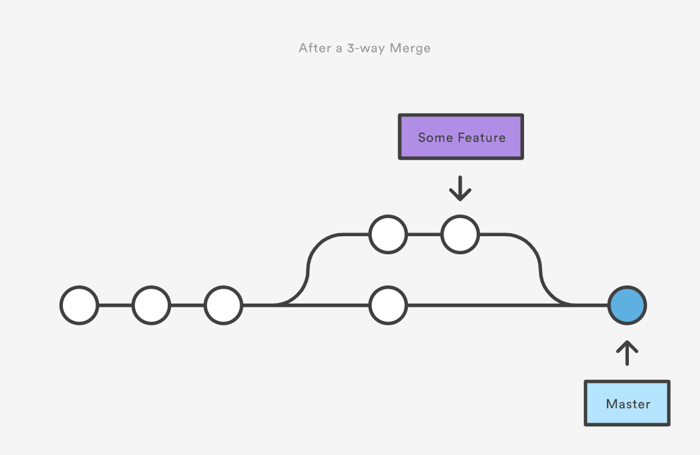
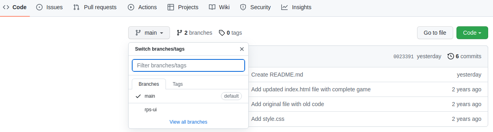

# {{ $frontmatter.title}}

## Введение

Теперь, когда мы умеем управлять DOM, пришло время вернуться к игре [«Камень, ножницы, бумага»](../rock-paper-scissors) и добавить к ней пользовательский интерфейс.

Перед тем как начать вносить изменения в ваш проект «Камень, ножницы, бумага», вам нужно познакомиться с понятием **ветвления (branching)** в Git, чтобы вы могли вносить изменения, не беспокоясь о том, что сломаете уже существующую функциональность.

Ветки в Git позволяют вашему репозиторию одновременно хранить несколько альтернативных версий ваших файлов. На самом деле вы уже (в некотором смысле) использовали ветки с момента вашего первого коммита — просто могли об этом не знать! В уроке по настройке Git, когда вы выполняли команду `git config --global init.defaultBranch main`, вы задавали имя так называемой ветки по умолчанию для ваших репозиториев. Ветка по умолчанию — это та, которая создаётся при первом коммите в проекте, и в данном случае мы установили её имя как `main`, что соответствует современным стандартам.

Как ветви дерева (отсюда и название), все ветки проекта исходят от «ствола» (основной ветки) или от других веток.

Когда вы делаете коммиты в определённой ветке, эти изменения существуют только в этой ветке, а все остальные ветки остаются в том же состоянии, в котором они были на момент создания новой ветки.

Это означает, что вы можете сохранить вашу основную ветку (`main`) как место для полностью готовых и работающих функций, а каждую новую функцию добавлять в проект через отдельные ветки, которые мы называем **ветками функциональностей (feature branches)**.

## Обзор урока

<LessonOverview />

- Как создать новую ветку.
- Как объединять (мерджить) ветки.
- Лучшие практики и случаи использования веток.

## Использование веток

Вы можете создать новую ветку с помощью команды `git branch <имя_ветки>`. Затем вы можете переключиться на новую ветку, используя команду `git checkout <имя_ветки>`. Также можно создать новую ветку и сразу переключиться на неё одной командой, используя флаг `-b` вместе с `checkout`: `git checkout -b <имя_ветки>`.

Посмотреть все текущие ветки можно с помощью команды `git branch` без дополнительных аргументов. Ветка, на которой вы сейчас находитесь, будет помечена звёздочкой (\*). Если вы хотите вернуться обратно на ветку `main` с любой другой ветки, вы можете сделать это точно так же, как и при переходе на любую другую ветку: `git checkout main`.

Когда вы закончите работу над своей веткой функциональности и будете готовы перенести сделанные в ней коммиты в основную ветку, вам нужно будет выполнить операцию, называемую слиянием (merge).

Слияния выполняются с помощью команды `git merge <имя_ветки>`, которая берёт изменения, закоммиченные в `<имя_ветки>`, и добавляет их в текущую ветку. Ниже показан пример создания ветки, внесения в неё изменений и последующего слияния с веткой `master`.

Иногда одни и те же строки в файле могут быть изменены в двух разных ветках. Когда это происходит, при попытке объединить эти ветки возникает конфликт слияния. Чтобы завершить слияние веток, вам сначала нужно разрешить конфликт, что будет рассмотрено в следующем уроке.

Когда ветка больше не нужна, её можно удалить с помощью команды `git branch -d <имя_ветки>`, если ветка уже была объединена с `main`, или с помощью `git branch -D <имя_ветки>`, если она не была объединена. Обычно вы захотите удалять ветки после завершения работы с ними, иначе они могут накапливаться и затруднять поиск нужной ветки, когда она вам понадобится.

## Совместное использование кода

Ещё один отличный случай использования веток — это совместное использование кода с другими людьми, который вы совсем не хотите добавлять в свою основную ветку (или ветку функциональности).

Например: если у вас есть ошибка в новой функции, над которой вы работаете, которую вы не можете понять, и она приводит к сбою кода, вы не захотите коммитить этот сломанный код и иметь его в "постоянной истории" вашего проекта. Вместо этого вы можете создать новую временную ветку, переключиться на неё и закоммитить свой код в эту новую ветку. Если затем вы запушите эту новую временную ветку на GitHub, вы сможете поделиться ею с другими, кто может помочь решить вашу проблему. В задании ниже вы получите практический опыт создания новых веток.

## Задание

1. Создайте новую ветку в вашем предыдущем репозитории [Rock Paper Scissors](../rock-paper-scissors)

   1. Поскольку мы будем создавать пользовательский интерфейс для нашей игры «Камень, ножницы, бумага», создайте новую ветку и переключитесь на неё с помощью команды `git checkout -b rps-ui`.

   2. Теперь вы работаете в ветке `rps-ui` локально. Однако эта ветка ещё не существует в вашем удаленном репозитории. Если вы перейдете на страницу вашего репозитория на GitHub, вы увидите, что у вас есть только 1 ветка, которая является `main`. Давайте запушим эту новую ветку в ваш удаленный репозиторий с помощью команды `git push origin rps-ui`. Теперь вы увидите две ветки в вашем репозитории на GitHub! Вы можете выбрать новую ветку на GitHub, используя выпадающее меню выбора веток, показанное на скриншоте ниже.

   

   3. Убедитесь, что вы находитесь в ветке `rps-ui`. Вы можете проверить это с помощью команды `git branch`. Ветка, на которой вы сейчас находитесь, будет помечена звездочкой (\*). Если по какой-то причине вы находитесь в другой ветке, переключитесь на `rps-ui` с помощью команды `git checkout rps-ui`. Теперь вы готовы работать над новой функцией! Примечание: Вы можете добавлять файлы, делать коммиты в эту ветку и пушить изменения в ваш репозиторий, точно так же, как и с основной веткой. Всё то же самое, за исключением того, что при пуше изменений вы будете использовать `git push origin rps-ui` вместо `git push origin main`, поскольку мы пушим в нашу новую ветку.

2. В нашем пользовательском интерфейсе игрок должен иметь возможность играть в игру, нажимая на кнопки, а не вводя свой ответ в prompt.

   1. Пока что удалите логику, которая играет ровно пять раундов.

   2. Создайте три кнопки, по одной для каждого выбора. Добавьте обработчики событий к кнопкам, которые вызывают вашу функцию `playRound` с правильным `playerSelection` каждый раз, когда кнопка нажата. (вы можете оставить console.log для этого шага)

   3. Добавьте div для отображения результатов и измените все ваши console.log на методы DOM.
      Отображайте текущий счёт и объявляйте победителя игры, как только один из игроков наберет 5 очков.
      Вероятно, вам придется рефакторить (перерабатывать/переписывать) ваш оригинальный код, чтобы он работал для этого. Это нормально! Переработка старого кода - важная часть жизни программиста.
      Как только вы закончите с вашим пользовательским интерфейсом и убедитесь, что всё удовлетворительно, убедитесь, что все ваши изменения закоммичены в ветку `rps-ui` с помощью `git status` перед продолжением.
      Теперь давайте посмотрим, как мы можем объединить изменения из нашей ветки `rps-ui` обратно в нашу основную ветку.
      Переключитесь на ветку, В которую мы хотим объединить, т.е. `main`, с помощью команды `git checkout main`.
      Теперь давайте объединим нашу ветку `rps-ui` с `main`, нашей текущей веткой, с помощью `git merge rps-ui`.
      Если всё пройдет хорошо, наша ветка `rps-ui` теперь успешно объединена с `main`! Используйте `git log`, и вы увидите все коммиты, которые вы сделали в вашей ветке функциональности, поверх коммитов, которые вы сделали в основной ветке. Теперь наш последний шаг!
      Давайте запушим нашу основную ветку в наш удаленный репозиторий, выполнив `git push origin main`. Перейдите в ваш репозиторий на GitHub, и вы увидите, что наша основная ветка будет содержать все изменения и коммиты, которые вы сделали в ветке `rps-ui`. Поздравляем! Вы успешно запушили вашу первую функцию в вашу production ветку!
      Теперь, когда у нас есть весь код в основной ветке, нам больше не нужна наша ветка `rps-ui`. Давайте проведем очистку, как локально, так и в удаленном репозитории. Удалите ветку из нашего локального репозитория с помощью `git branch -d rps-ui`, а также удалите её из удаленного репозитория на GitHub с помощью `git push origin --delete rps-ui`. Поздравляем, мы закончили нашу очистку!
      Обязательно опубликуйте проект на GitHub Pages и добавьте ссылку на живой просмотр в урок проекта.
