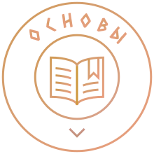
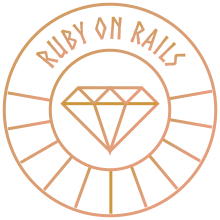
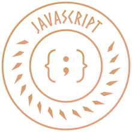

# {{ $frontmatter.title }}

## Как проходить курс

::: raw

  <h2 class="text-xl bold">Сперва изучите «Основы»</h2>

  

    

      
      

        <h3 class="mt-0 mb-3 text-orange-800">Основы</h3>
        <a href="/foundations/introduction/how-this-course-will-work">Смотреть</a>
      

    

    

      
Здесь берёт начало ваш путь! Практическое введение в основной инструментарий для разработки функциональных веб-сайтов. Вы освоите реальные задачи разработчиков и базовые концепции для продвинутых курсов.

    

  

  <h2>Затем выберите дальнейший путь</h2>

  

    

      

        
        

          <h3 class="text-stone-800">Фулстек Ruby on Rails</h3>
          <a href="/">Смотреть</a>
        

      

      

        
Данный курс представляет собой полный цикл обучения Ruby on Rails. Для максимальной эффективности изучайте материалы в предложенной последовательности. В результате вы овладеете навыками разработки отзывчивых веб-приложений, начиная с основ.

      

    

    

      

        
        

          <h3 class="text-stone-800">Фулстек JavaScript</h3>
          <a href="/">Смотреть</a>
        

      

      

        
Этот путь проведёт вас через всю нашу программу по JavaScript. Проходите курсы в указанном порядке — и вы освоите всё необходимое для создания современных адаптивных веб-приложений с нуля на JavaScript и Node.js.

      

    

  

  <ContactCard />
  

:::
