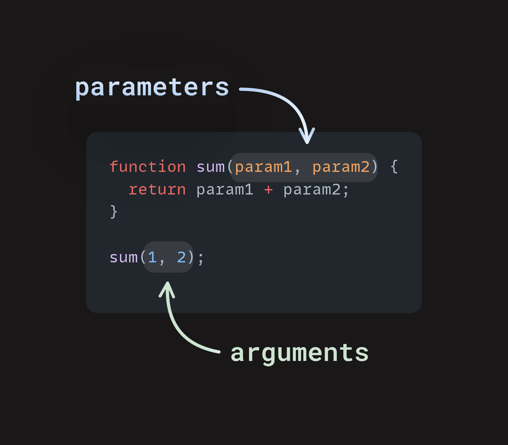

# {{ $frontmatter.title}}

## Введение

Сейчас всё станет _намного_ интереснее. До этого вы уже написали внушительное количество кода для решения различных задач, но этот код мог бы быть гораздо полезнее.

Представьте, что вы берёте один из ваших скриптов и упаковываете его в небольшой пакет, который можно использовать снова и снова, не переписывая или изменяя код. Это — сила функций, и они _постоянно_ используются в JavaScript.

## Обзор урока

Темы, которые вы изучите в данном уроке:

- Как определять и вызывать различные типы функций.
- Как использовать возвращаемые значения (return).
- Что такое область видимости (scope) функции.

## Функции

Давайте обсудим параметры и аргументы на примере следующей функции:

```javascript
function favoriteAnimal(animal) {
  return animal + " is my favorite animal!";
}

console.log(favoriteAnimal("Goat"));
```

В JavaScript **параметры** — это элементы, перечисленные в скобках `()` при объявлении функции. **Аргументы** — это реальные значения, которые мы передаём функции при её вызове.

В приведённом выше примере объявление функции находится на первой строке: `function favoriteAnimal(animal)`. Параметр `animal` указан внутри скобок. Мы могли бы назвать его `pet`, `x` или даже `blah`. Однако в данном случае имя `animal` делает наш код более понятным, так как даёт контекст того, что именно будет содержаться в этой переменной.

Размещая `animal` внутри скобок функции `favoriteAnimal()`, мы сообщаем JavaScript, что собираемся передать некоторое значение в эту функцию. То есть `animal` — это просто заполнитель для будущего значения. Но какое именно значение мы передаём?

На последней строке `favoriteAnimal('Goat')` мы вызываем функцию `favoriteAnimal` и передаём ей значение `'Goat'`. Здесь `'Goat'` является **аргументом**. Мы говорим функции: «Пожалуйста, возьми `'Goat'` и используй его там, где стоит заполнитель `animal`». Благодаря гибкости параметров мы можем указать любое животное как своё любимое.

Ниже представлена диаграмма, которая поможет вам визуализировать, как параметры передаются в функцию и как из неё возвращаются значения:



Обратите внимание, что вызывая `favoriteAnimal()` внутри `console.log()` с аргументом `'Goat'`, мы получаем возвращаемое значение функции — строку `"Goat is my favorite animal!"`, которая выводится в консоль. Таким образом, мы передаём результат вызова функции `favoriteAnimal('Goat')` как аргумент другой функции — `console.log()`.

Имейте в виду эту возможность, потому что вы довольно часто будете передавать вызовы функций в качестве аргументов другим функциям. Если бы мы просто вызвали функцию без использования `console.log`, чтобы вывести результат, ничего не отобразилось бы в консоли, но функция всё равно вернула бы строку.

Попробуйте поэкспериментировать с этим кодом и заменить `'Goat'` на ваше любимое животное. Обратите внимание, как легко можно изменять аргумент? Также попробуйте изменить имя параметра `animal` в объявлении функции и в теле функции. Что произойдёт?

## Задание

1. Прочитайте [эту статью MDN о функциях](https://developer.mozilla.org/ru/docs/Learn_web_development/Core/Scripting/Functions). Не беспокойтесь, если некоторые моменты будут сложными — сосредоточьтесь на разделе **«Область видимости функции»**. Тема области видимости часто вызывает затруднения у новичков, поэтому важно потратить время на её изучение заранее.
2. Прочитайте [статью о возвращаемых значениях](https://developer.mozilla.org/ru/docs/Learn_web_development/Core/Scripting/Return_values).
3. Далее прочитайте [статью о базовых понятиях функций на Javascript.ru](https://learn.javascript.ru/function-basics). Ранее мы уже упоминали её, но стоит обратить внимание на недавно добавленную возможность — **Значения по умолчанию**.
   > Примечание: В разделе "Функции == Комментарии", а также в последнем "задании" в конце этого урока используются петли, о которых вы узнаете в следующем уроке. Не беспокойтесь о них.
4. Прочитайте [статью о Function Expression](https://learn.javascript.ru/function-expressions), чтобы лучше понять разницу между декларациями и выражениями. Также ознакомьтесь с [введением в стрелочные функции](https://learn.javascript.ru/arrow-functions), которые тоже полезны, хотя пока не обязательны к освоению. Они встречаются часто, и хорошо, что вы будете знать, что это такое.
5. Наконец, изучите [стек вызовов в JavaScript](https://js-ts-node.github.io/call-stack-stek-vyzovov-v-javascript/). Эта статья подробно рассматривает стек вызовов и работу возвращаемых значений при цепочке вызовов функций. Не расстраивайтесь, если вы не сразу всё поймёте — главное понимать, куда уходят ваши возвращаемые значения.

**Пишем функции!** Добавьте эти функции в тег `<script>` простого HTML-файла. Если вы забыли, как это сделать, перечитайте наши инструкции о том, как [запускать JavaScript-код](../variables-operators/).

Пока что просто напишите каждую функцию и проверьте вывод с помощью `console.log`.

1. Напишите функцию `add7`, которая принимает одно число и возвращает его, увеличенное на 7.
2. Напишите функцию `multiply`, которая принимает два числа и возвращает их произведение.
3. Напишите функцию `capitalize`, которая принимает строку и возвращает ту же строку, но с заглавной первой буквы. Убедитесь, что она работает со строками любого регистра: lowercase, UPPERCASE или BoTh.
4. Напишите функцию `lastLetter`, которая принимает строку и возвращает последний символ этой строки:
   ```javascript
   lastLetter("abcd"); // должно вернуть "d"
   ```

## Проверка знаний

Ответьте на следующие вопросы, чтобы закрепить ключевые темы урока. Если вы не можете ответить на какой-то вопрос, кликните по нему, чтобы повторить материал. Однако запоминать всё досконально пока не требуется.

**Для чего нужны функции?**  
<details>  
<summary>Ответ</summary>  

Функции нужны для того, чтобы группировать повторяющийся код в отдельные блоки, которые можно вызывать по имени. Это делает код более читаемым, переиспользуемым и упрощает его поддержку.

</details>

**Как вызвать функцию?**  
<details>  
<summary>Ответ</summary>  

Чтобы вызвать функцию, нужно использовать её имя, за которым следуют круглые скобки `()`. Если функция принимает параметры, их нужно передать внутри скобок через запятую.

Пример:  
```javascript
function greet(name) {
    console.log("Привет, " + name);
}

greet("Анна"); // Вызов функции с аргументом "Анна"
```

</details>

**Что такое анонимные функции?**  
<details>  
<summary>Ответ</summary>  

Анонимные функции — это функции без имени. Они часто используются как значения, например, как обратные вызовы (callback-функции), или присваиваются переменным.

Пример:
```javascript
setTimeout(function() {
    console.log("Прошла секунда!");
}, 1000);
```

</details>

**Что такое область видимости (scope) функции?**  
<details>  
<summary>Ответ</summary>  

Область видимости (scope) функции — это контекст выполнения, в котором определяются переменные и параметры, доступные только внутри этой функции. Внешний код не имеет доступа к внутренним переменным функции, если они объявлены с помощью `let`, `const` или `var`.

Пример:
```javascript
function example() {
    let x = 10;
    console.log(x); // работает
}
console.log(x); // ошибка: x не определена
```

</details>

**Что такое возвращаемые значения (return values)?**  
<details>  
<summary>Ответ</summary>  

Возвращаемое значение — это результат работы функции, который она отправляет обратно в место, где была вызвана. Оно задаётся с помощью ключевого слова `return`.

Пример:
```javascript
function sum(a, b) {
    return a + b;
}

let result = sum(2, 3); // result будет равно 5
```

</details>

**Что такое стрелочные функции (arrow functions)?**  
<details>  
<summary>Ответ</summary>  

Стрелочные функции — это более короткий способ записи функций в JavaScript, использующий синтаксис `=>`. У них нет собственного `this`, что делает их удобными в определённых контекстах.

Пример:
```javascript
const multiply = (a, b) => a * b;

console.log(multiply(3, 4)); // 12
```

</details>

**В чём разница между объявлением функции (function declaration) и выражением-функцией (function expression)?**  
<details>  
<summary>Ответ</summary>  

Разница между объявлением функции и выражением-функцией заключается в том, как и когда они создаются в памяти JavaScript (поднятие, hoisting):

- **Function Declaration** (объявление функции):  
  Функция создается до выполнения кода и может быть вызвана до её объявления в коде.
  ```javascript
  sayHello(); // работает

  function sayHello() {
      console.log("Привет");
  }
  ```

- **Function Expression** (выражение-функция):  
  Функция создается только в момент выполнения строки, где она определена. Её нельзя вызвать до этого.
  ```javascript
  sayHi(); // ошибка: sayHi is not a function

  const sayHi = function() {
      console.log("Здравствуйте");
  };
  ```

</details>

## Дополнительные материалы

Этот раздел содержит полезные ссылки на дополнительный материал. Он не обязателен, но может помочь лучше понять тему:

- [В чём разница между var и let](https://htmlacademy.ru/blog/js/var-vs-let) `Доктайп`
- [Стек вызовов в JavaScript: работа, асинхронность и ошибки](https://sky.pro/wiki/javascript/stek-vyzovov-v-javascript-rabota-asinhronnost-i-oshibki/) `Skypro`
