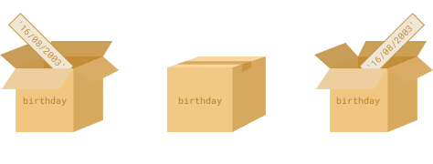

# {{ $frontmatter.title}}

## Введение

Наша задача — сделать веб-страницу интерактивной, а именно для этого и существует JavaScript.

В этом разделе мы сосредоточимся на основах JavaScript и узнаем, как с его помощью управлять различными взаимодействиями между веб-страницей и пользователем.

## Обзор урока

Темы, которые вы изучите в данном уроке:

- Как запускать JavaScript-код с помощью HTML-файла.
- Объявлять переменные с использованием `let` и `const`.
- Выполнять числовые операции.
- Выполнять строковые операции.
- Использовать логические и математические операторы.

## Как запустить JavaScript-код

Большую часть JavaScript-кода, который мы будем писать в рамках курса «Основы», мы будем запускать через браузер. В более поздних уроках курса (в частности, по Node.js) вы узнаете, как выполнять JavaScript вне браузерной среды.

Однако пока что, если не указано иное, всегда используйте браузер для запуска своего кода. Это поможет избежать непредвиденных ошибок.

Самый простой способ начать — создать HTML-файл и разместить в нём JavaScript-код. Используйте сниппет `! + TAB` в VS Code, чтобы создать базовый шаблон HTML в файле на вашем компьютере. Убедитесь, что в нём есть тег `<script>`:

```html
<!DOCTYPE html>
<html lang="ru">
  <head>
    <meta charset="UTF-8" />
    <meta name="viewport" content="width=device-width, initial-scale=1.0" />
    <title>Документ</title>
  </head>
  <body>
    <script>
      // Ваш JavaScript начинается здесь!
      console.log("Привет, мир!");
    </script>
  </body>
</html>
```

Сохраните этот файл и откройте его в веб-браузере. Затем откройте консоль браузера следующим образом:

- Щелкните правой кнопкой мыши по пустому месту на странице.
- Выберите пункт "Просмотреть код".
- Найдите и выберите вкладку **Console** (Консоль), где вы увидите результат выполнения команды `console.log`.

> **Live Preview**
>
> Вы можете использовать расширение [Live Preview](https://marketplace.visualstudio.com/items?itemName=ms-vscode.live-server) в Visual Studio Code, чтобы автоматически обновлять содержимое браузера при сохранении файла. Это избавит вас от необходимости вручную обновлять страницу после каждого изменения кода. Попробуйте изменить текст внутри `console.log()` и посмотрите, как изменения сразу применяются!

`console.log()` — это команда, которая выводит информацию в консоль разработчика в браузере. Её можно использовать для отображения результатов выполнения примеров и упражнений. Мы рекомендуем вам активно использовать её при прохождении всех примеров в этом и последующих уроках.

Ещё один способ подключения JavaScript к веб-странице — через внешний скрипт. Это похоже на подключение внешнего CSS-файла:

```html
<script src="javascript.js"></script>
```

JavaScript-файлы имеют расширение `.js`, аналогично тому, как стилевые файлы имеют расширение `.css`. Внешние JS-файлы удобны для работы с более сложными скриптами.

Мы назвали наш файл `javascript.js`, но могли бы выбрать любое другое имя: например, `my-script.js` или даже просто `.js`. Главное — наличие расширения `.js`.

## Переменные

Переменные — это фундаментальная часть любого программного кода. Их можно представить как «контейнеры» для хранения данных в вашей программе.



Объявлять переменные можно с помощью ключевого слова `let`. Давайте попробуем:

```javascript
let name = "John";
let surname = "Doe";

console.log(name);
console.log(surname);
```

Каким будет результат выполнения `console.log`? Попробуйте сами!

Также переменным можно присваивать новые значения:

```javascript
let age = 11;
console.log(age); // выводит 11 в консоль

age = 54;
console.log(age); // что выведется теперь?
```

Обратите внимание: на четвёртой строке мы не используем `let` — он нужен только при первом объявлении переменной. Здесь же мы просто меняем значение уже существующей переменной.

Замена значений — это полезная возможность, но иногда мы хотим, чтобы значение оставалось неизменным. Например, число π (пи) редко когда требует перезаписи. Для таких случаев используется ключевое слово `const`.

```javascript
const pi = 3.14;
pi = 10;

console.log(pi); // Что выведется?
```

Возможно, вы думаете, что в консоли появится `3.14`. Но на самом деле — ошибка! Код даже не доходит до строки с `console.log`. Почему так происходит?

На самом деле, ошибки — это полезный инструмент, помогающий понять, что пошло не так в вашем коде. Без них программа могла бы работать некорректно, но найти проблему было бы гораздо труднее.

Подводя итог, существует два основных способа объявления переменных:

- `let` — позволяет переопределять значение переменной.
- `const` — создаёт константу, которую нельзя изменить; попытка перезаписи вызывает ошибку.

Также есть третий способ — `var`, который использовался ранее в JavaScript. Он работает похоже на `let`, но имеет ряд особенностей, которые были исправлены в новых версиях языка. Сегодня `var` практически не используется, хотя может встречаться в старом коде. Полезно знать, что `var` существует.

## Числа

Числа — это основа логики программирования! На самом деле сложно представить полезную задачу в программировании, которая не требовала бы хотя бы минимальных математических знаний. Поэтому важно хорошо понимать, как работают числа в JavaScript.

Если вы ходили в школу, то работа с числами покажется вам знакомой. Например, математическое выражение `(3 + 2) - 76 * (1 + 1)` является также корректным JavaScript-выражением. Если поместить его в `console.log()`, то он будет вычислен, и в консоль выведется правильный результат. Попробуйте сами!

## Практика

Попробуйте выполнить следующие упражнения, добавив код в тег `<script>` вашего HTML-файла:

1. **Сложите 2 числа!** В вашем скрипте напишите `console.log(23 + 97)`. При запуске это должно вывести `120`.

2. Сделайте то же самое, но **сложите 6 различных чисел**.

3. Теперь **выведите значение** следующего выражения: `(4 + 6 + 9) / 77`. В консоли должно отобразиться приблизительно `0.24675`.

4. Давайте **поработаем с переменными**!

   - Добавьте в тег `<script>` строку: `let a = 10;`
   - Ниже добавьте `console.log(a);`. При запуске браузерная консоль должна вывести `10`.
   - Затем переназначьте переменной `a` другое числовое значение. После этого снова выведите `a` — теперь должно отображаться обновлённое значение (предыдущий вывод всё ещё будет показывать старое значение `10`, так как оно было до переназначения `a`).
   - Теперь добавьте в конец скрипта строку: `let b = 7 * a;`
   - Выведите `b`. Это должно быть равно результату умножения `7` на текущее значение `a`.

5. **Попробуйте следующую последовательность**:

   - Объявите константную переменную `max` со значением `57`.
   - Объявите еще одну константную переменную `actual` и присвойте ей значение `max - 13`.
   - Объявите еще одну константную переменную `percentage` и присвойте ей значение `actual / max`.
   - Если вы выведете `percentage`, в консоли должно отобразиться значение вроде `0.7719`.

6. **Потратьте несколько минут** на эксперименты с различными вещами в вашем теге `<script>`. В дальнейшем мы научимся отображать эти данные на веб-странице, но вся эта логика останется неизменной. Убедитесь, что вы хорошо разобрались в материале, прежде чем переходить к следующему разделу.

7. **Ознакомьтесь со следующими статьями**, чтобы углубить свои знания:
   - Прочитайте про переменные в JavaScript на [JavaScript.ru](https://learn.javascript.ru/variables).
   - Этот [урок по арифметике JavaScript](https://msiter.ru/tutorials/javascript/js_arithmetic) + [по операторам](https://msiter.ru/tutorials/javascript/js_operators) — это хорошее введение в то, что вы можете достичь с помощью чисел в JavaScript.
   - Эта статья на MDN по [математическим операциям в JavaScript](https://developer.mozilla.org/ru/docs/Web/JavaScript/Guide/Expressions_and_operators) рассматривает ту же тему с немного другой точки зрения и также рассказывает, как применять базовые математические операции в JavaScript. С числами можно делать гораздо больше, но для начала вам нужно освоить именно это.
   - Прочитайте (и пишите код вместе с текстом!) статью про [операторы в JavaScript](https://learn.javascript.ru/operators). Не забудьте выполнить задания внизу страницы! Это поможет вам хорошо понять, что можно делать с числами (и не только) в JavaScript.

## Проверка знаний

Ответьте на следующие вопросы:

1. Какие три ключевых слова используются для объявления переменных?

    <details>
    <summary>Ответ</summary>

    `let`, `const`, `var`.

    </details>

2. Какое из объявлений переменных лучше избегать и почему?

    <details>
    <summary>Ответ</summary>

    `var` — потому что он имеет странное поведение в контексте области видимости и поднятия (hoisting).

    </details>

3. Какие правила нужно соблюдать при именовании переменных?

    <details>
    <summary>Ответ</summary>

    Имя должно начинаться с буквы, `$` или `_`. Не может быть ключевым словом (например, `let`, `if`). Лучше использовать стиль `camelCase`.

    </details>

4. Что происходит при сложении чисел и строк?

    <details>
    <summary>Ответ</summary>

    Число преобразуется в строку, и результатом будет строка. Например: `5 + "5"` → `"55"`.

    </details>

5. Как работает оператор остатка (`%`)?

    <details>
    <summary>Ответ</summary>

    Возвращает остаток от деления. Например: `10 % 3` → `1`.

    </details>

6. В чём разница между `==` и `===`?

    <details>
    <summary>Ответ</summary>

    `==` сравнивает значения с приведением типов, `===` — строгое сравнение без приведения типов. Например: `5 == "5"` → `true`, `5 === "5"` → `false`.

    </details>

7. Когда возникает результат `NaN`?

    <details>
    <summary>Ответ</summary>

    Когда операция с числами невозможна. Например: `parseInt("abc")` или `0 / 0`.

    </details>

8. Как увеличивать и уменьшать число?

    <details>
    <summary>Ответ</summary>

    С помощью операторов `++` (инкремент) и `--` (декремент). Например: `let x = 5; x++; console.log(x);` → `6`.

    </details>

9. В чём разница между префиксным и постфиксным инкрементом?

    <details>
    <summary>Ответ</summary>

    - Префиксный (`++x`) — сначала увеличивает, потом возвращает значение.
    - Постфиксный (`x++`) — сначала возвращает текущее значение, потом увеличивает.

    </details>

10. Что такое приоритет операторов и как он обрабатывается в JS?

    <details>
    <summary>Ответ</summary>

    Приоритет определяет порядок выполнения операций. Например, умножение выполняется раньше сложения. Вы можете использовать скобки, чтобы изменить порядок.

    </details>

11. Как открыть инструменты разработчика и консоль?

    <details>
    <summary>Ответ</summary>

    Нажмите правой кнопкой мыши на странице → «Просмотреть код» → выберите вкладку **Console**.

    </details>

12. Как выводить информацию в консоль?

    <details>
    <summary>Ответ</summary>

    С помощью команды `console.log()`.

    </details>

13. Что делает унарный плюс (`+"10"`) со строковым представлением числа?

    <details>
    <summary>Ответ</summary>

    Преобразует строку в число. Например: `typeof +"10"` → `"number"`.

    </details>

## Дополнительные материалы

::: info Дополнительно

- [Введение в JavaScript](https://javascript.info/introduction) `Javascript.ru`

- [Что такое JavaScript?](https://developer.mozilla.org/en-US/docs/Web/JavaScript/Guide/Introduction) `MDN`

:::
