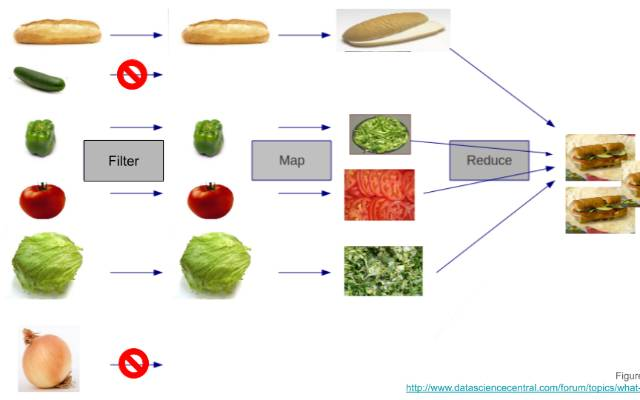

# {{ $frontmatter.title}}

## Введение

Одной из задач программирования является повторение действий. Хотя некоторое ручное повторение допустимо, иногда мы хотим сделать повторяющиеся инструкции более читаемыми. Ещё одна проблема — работа с большими объемами данных. Например, если вы хотите сохранить имена всех студентов в вашей группе, как это сделать? Можно создать отдельную переменную для каждого имени, но такой подход будет утомительным и неэффективным. Также будет сложно управлять и обновлять такие данные. Что делать, если позже потребуется изменить или получить доступ к именам?

К счастью, существуют способы справиться с этими проблемами. В этом уроке вы узнаете о циклах — управляющих конструкциях, которые позволяют выполнять блок кода несколько раз. Вы также познакомитесь с массивами — структурами данных, способными хранить множество значений в одной переменной. Массивы очень полезны для организации и обработки больших объемов информации. Циклы часто оказываются удобным инструментом для выполнения одинаковых операций над каждым элементом массива. Наконец, вы познакомитесь с разработкой через тестирование (TDD) — практикой написания тестов для кода до того, как сам код будет написан.

## Обзор урока

Темы, которые вы изучите в данном уроке:

- Использование циклов.
- Использование массивов.
- Использование методов массивов, таких как `map`, `filter` и `reduce`.
- Практика в решении задач по TDD.

## Циклы

Компьютеры не устают, и они очень, очень быстры! Поэтому они отлично подходят для решения задач, связанных с многократным выполнением вычислений. В некоторых случаях компьютер может выполнить одну и ту же задачу тысячи или даже миллионы раз всего за несколько секунд, тогда как человеку это могло бы занять много часов (конечно, скорость зависит от сложности вычисления и производительности самого компьютера).

Чтобы повторить набор инструкций несколько раз, можно использовать **цикл**. Ознакомьтесь со следующими материалами о циклах. Некоторые из них содержат примеры с массивами, подробнее о которых пойдет речь в следующем разделе. Пока достаточно знать, что массивы — это просто списки элементов.

1. Прочитайте статью [MDN «Зацикливание кода»](https://developer.mozilla.org/ru/docs/Learn_web_development/Core/Scripting/Loops). Она довольно длинная, но обязательно пройдите разделы «Практическое упражнение» внизу страницы.
2. Еще раз те же сведения, но в немного другом контексте, можно найти в руководстве [Javascript.ru «Циклы: while и for»](https://learn.javascript.ru/while-for). Обязательно выполните упражнения в конце страницы. Лучше всего вы усваиваете материал, практикуясь самостоятельно.

## Массивы

Строки и числа могут быть нашими основными строительными блоками, но по мере усложнения ваших скриптов вам понадобится способ работы с большими объемами данных. К счастью, в JavaScript есть несколько типов данных, которые как раз для этого и предназначены. Массив представляет собой упорядоченную коллекцию элементов (строк, чисел или других объектов). Возможно, вы заметите, что некоторые из методов массива, описанных в следующих материалах, делают то же самое, что и циклы. Иногда для более точного управления лучше использовать обычный цикл, а иногда нужный результат можно достичь подходящим методом массива — это проще и удобнее читать.

1. Короткое видео [Ускоренный JS #5 - Массивы](https://vkvideo.ru/video-74984782_456240536) дает общее представление о массивах в JavaScript.
2. Ознакомьтесь с этим введением в массивы от [Javascript.ru](https://learn.javascript.ru/array). Вам не нужно выполнять упражнения в конце страницы.
3. Прочитайте руководство [Javascript.ru по методам массивов](https://learn.javascript.ru/array-methods), чтобы подробнее узнать о дополнительных методах массивов в JavaScript. Опять же, выполнять упражнения в конце страницы не обязательно — мы вернемся к ним позже.
4. Добавьте в закладки документацию MDN по [массивам](https://developer.mozilla.org/ru/docs/Web/JavaScript/Reference/Global_Objects/Array). Пока нет необходимости запоминать всё содержание. Здесь вы найдете описание всех встроенных свойств и методов массивов и их документации. Скорее всего, вы будете часто обращаться к этому ресурсу при написании кода и решении задач.

## Некоторые примеры «магии» массивов

Кроме того, что массивы представляют собой удобный способ хранения данных, у них также есть множество встроенных функций для мощной и гибкой обработки этих данных. По мере накопления опыта вы начнете замечать, как часто можно использовать эти функции! На самом деле таких функций не так уж много, но, как вы скоро увидите, возможности, которые они открывают, почти безграничны.

В качестве примера рассмотрим функцию `sumOfTripledEvens` («сумма утроенных чётных чисел»). Она будет:

1. Принимать массив.
2. Для каждого чётного числа — утраивать его.
3. Затем складывать все полученные числа.
   Можете ли вы придумать, как реализовать такую функцию, используя псевдокод?

Нам нужно:

1. Выполнить операцию только над чётными числами.
2. Преобразовать эти числа, умножив их на 3.
3. В конце сложить результаты этого преобразования.

Используя эту логику, вы можете написать что-то подобное:

```javascript
function sumOfTripledEvens(array) {
  let sum = 0;
  for (let i = 0; i < array.length; i++) {
    // Шаг 1: Проверяем, является ли элемент чётным числом
    if (array[i] % 2 === 0) {
      // Шаг 2: Утраиваем это число
      const tripleEvenNumber = array[i] * 3;

      // Шаг 3: Добавляем новое число к общей сумме
      sum += tripleEvenNumber;
    }
  }
  return sum;
}
```

В приведённом выше коде есть три важных фрагмента:

- `if (array[i] % 2 === 0)` — проверяет, является ли число чётным.
- `const tripleEvenNumber = array[i] * 3` — утраивает число.
- `sum += tripleEvenNumber` — добавляет результат к общей сумме.

Каждая из этих строк решает важную задачу. Однако то же самое можно сделать с помощью методов массива, и иногда результат получается даже понятнее и легче для чтения. Давайте посмотрим, как мы можем воспользоваться ими.

**Метод map**

`map` — это один из таких методов. Он принимает в качестве аргумента функцию обратного вызова (callback), другими словами — вы передаёте одну функцию внутрь другой.

Допустим, у нас есть функция `addOne`, которая принимает число `num` и возвращает его, увеличенное на единицу. Также у нас есть массив чисел `[1, 2, 3, 4, 5]`. И мы хотим увеличить каждое число в массиве на 1 с помощью этой функции.

Вместо того чтобы писать цикл `for` и перебирать массив вручную, мы можем воспользоваться методом `map`, который автоматически переберёт элементы за нас. Нам нужно лишь передать нужную функцию:

```javascript
function addOne(num) {
  return num + 1;
}

const arr = [1, 2, 3, 4, 5];
const mappedArr = arr.map(addOne);
console.log(mappedArr); // Выведет [2, 3, 4, 5, 6]
```

Метод `map` возвращает новый массив и **не изменяет** исходный массив.

```javascript
// Исходный массив не изменился!
console.log(arr); // Выведет [1, 2, 3, 4, 5]
```

Использование `map` может быть более элегантным решением по сравнению с написанием цикла. Но можно сделать ещё лучше! Если функция `addOne` используется только один раз и имеет простую логику, мы можем определить её прямо внутри метода `map` с помощью стрелочной функции:

```javascript
const arr = [1, 2, 3, 4, 5];
const mappedArr = arr.map((num) => num + 1);
console.log(mappedArr); // Выведет [2, 3, 4, 5, 6]
```

**Метод filter**

Метод `filter` похож на `map`. Он тоже перебирает массив и применяет функцию ко всем его элементам. Однако вместо преобразования значений он создаёт новый массив, в который попадают только те элементы, для которых функция вернула `true`.

Предположим, у нас есть функция `isOdd`, которая возвращает `true`, если число нечётное, и `false` — если чётное.

Метод `filter` ожидает, что callback-функция вернёт `true` или `false`. Если возвращается `true`, элемент добавляется в новый массив. В противном случае — игнорируется.

Рассмотрим тот же массив `[1, 2, 3, 4, 5]`. Если мы хотим удалить все чётные числа, мы можем воспользоваться `.filter()` следующим образом:

```javascript
function isOdd(num) {
  return num % 2 !== 0;
}

const arr = [1, 2, 3, 4, 5];
const oddNums = arr.filter(isOdd);
console.log(oddNums); // Выведет [1, 3, 5]
console.log(arr); // Исходный массив остался неизменным: [1, 2, 3, 4, 5]
```

- Метод `filter` перебирает массив `arr`, поочерёдно передавая каждый элемент в функцию `isOdd`.
- Функция `isOdd` возвращает `true`, если число нечётное, и такой элемент включается в выходной массив.
- Если число чётное, `isOdd` возвращает `false`, и элемент не включается в результат.

**Метод reduce**

Наконец, допустим, мы хотим умножить все числа в нашем массиве друг на друга: `1 * 2 * 3 * 4 * 5`. Для этого сначала пришлось бы объявить переменную `total` и присвоить ей начальное значение `1`. Затем мы перебрали бы массив с помощью цикла `for` и умножили это значение на текущий элемент массива.

Однако на самом деле нам не нужно всё это делать вручную — у нас есть метод `reduce`, который выполнит эту задачу за нас. Как и `.map()`, и `.filter()`, он ожидает передачи callback-функции. Однако у этого метода есть два ключевых отличия:

1. **Callback-функция принимает два аргумента вместо одного**:

   - Первый аргумент — это аккумулятор (`total`), то есть текущее значение результата на каждом шаге итерации.
   - В первый раз значение аккумулятора будет либо равно начальному значению (`initialValue` — см. следующий пункт), либо первому элементу массива, если начальное значение не задано.
   - Второй аргумент — это текущий элемент массива (`currentItem`), с которым производится операция на данном шаге.

2. **Метод `reduce` может принимать начальное значение (`initialValue`) как второй (необязательный) аргумент после callback-функции**. Это бывает полезно, когда вы не хотите, чтобы начальное значение было первым элементом массива. Например, если вы хотите сложить все числа в массиве, вы можете вызвать `reduce()` без `initialValue`, но если вы хотите сложить все числа и добавить к ним 10, тогда вы можете использовать `10` как `initialValue`.

Пример:

```javascript
const arr = [1, 2, 3, 4, 5];
const productOfAllNums = arr.reduce((total, currentItem) => {
  return total * currentItem;
}, 1);

console.log(productOfAllNums); // Выведет 120
console.log(arr); // Выведет [1, 2, 3, 4, 5] (исходный массив не изменился)
```

В этой функции:

- Мы передаем callback-функцию `(total, currentItem) => total * currentItem`.
- Начальное значение переменной `total` установлено равным `1` (второй аргумент `reduce`).

Что делает метод `.reduce()`? Он проходит по каждому элементу массива `arr` и применяет к нему callback-функцию. При этом изменяется только значение переменной `total`, а сам массив остаётся неизменным. После завершения работы метод возвращает финальное значение `total`.

**Итоги**

Вы узнали о трёх мощных методах массивов: `map`, `filter` и `reduce`. Они позволяют писать более понятный и читаемый код, который, в свою очередь, может быть менее подвержен ошибкам.

Для быстрого повторения этих методов посмотрите на эту картинку, которая наглядно объясняет их с помощью аналогии с приготовлением бутербродов:



Перед тем как перейти к заданию, давайте немного потренируемся! Перепишите функцию `sumOfTripledEvens(array)` с использованием этих трёх методов. Как только вы закончите и протестируете работу вашей функции, сверьтесь с решением ниже.

<details>
<summary>Ответ</summary>

```javascript
function sumOfTripledEvens(array) {
  return array
    .filter((num) => num % 2 === 0)
    .map((num) => num * 3)
    .reduce((acc, curr) => acc + curr);
}
```

</details>

## Разработка через тестирование (TDD)

Термин **test-driven development (TDD)**, или разработка через тестирование, часто встречается в мире программирования. Он описывает подход, при котором сначала пишутся автоматизированные тесты, определяющие, как должен работать ваш код, а уже потом пишется сам код. Например, если вы хотите создать функцию, которая складывает несколько чисел, сначала вы напишете тест, который вызывает эту функцию и проверяет, возвращает ли она ожидаемый результат. До того как вы реализуете саму функцию, тест будет падать, а после успешной реализации — проходить.

Во многих отношениях TDD гораздо более продуктивен, чем написание кода без тестов. Если у вас нет теста для той же функции сложения, вам придется запускать код вручную снова и снова, подставляя разные числа, чтобы убедиться, что всё работает. Для простой функции `add(2, 2)` это не такая уж большая проблема, но представьте, что вы работаете с чем-то более сложным — например, с функцией, которая проверяет, выиграл ли игрок в крестики-нолики: `game_win(["o", null, "x", null, "x", null, "x", "o", "o"])`. Без использования TDD вам, возможно, придется сыграть множество партий самостоятельно, просто чтобы проверить, правильно ли работает функция!

Писать такие тесты вы научитесь позже в этом курсе. А пока вы продолжите выполнять JavaScript-упражнения, которые делали ранее.

## Задание

1. Перейдите к упражнениям по методам массивов в конце статьи [JavaScript.ru про методы массивов](https://learn.javascript.ru/array-methods#tasks) и выполните **только следующие упражнения**:

   - `Переведите текст вида border-left-width в borderLeftWidth`
   - `Фильтрация по диапазону`
   - `Фильтрация по диапазону "на месте"`
   - `Сортировать в порядке по убыванию`
   - `Скопировать и отсортировать массив`
   - `Перемешайте массив`
   - `Оставить уникальные элементы массива`

2. После этого продолжите практиковаться, выполнив упражнение [JavaScript Array Cardio Practice - Day 1](https://youtu.be/HB1ZC7czKRs?si=sfz4JwRQ6YymYokW) от Wes Bos. Для этого вам нужно будет склонировать репозиторий [JavaScript30](https://github.com/wesbos/JavaScript30) (используйте fork и clone).

3. Затем посмотрите и повторите за Wes Bos упражнение [Array Cardio Day 2](https://www.youtube.com/watch?v=QNmRfyNg1lw).

4. Вернитесь к репозиторию с [JavaScript-упражнениями](https://github.com/TheOdinProject/javascript-exercises), который мы использовали ранее в задании по [типам данных и условным конструкциям](../data-types-сonditionals). Ознакомьтесь с файлом `README` перед выполнением следующих задач по порядку:

   - `06_repeatString`
   - `07_reverseString`
   - `08_removeFromArray`
   - `09_sumAll`
   - `10_leapYears`
   - `11_tempConversion`

> **Примечание:** Решения для этих упражнений можно найти в папке `solution` каждого упражнения.

## Проверьте свои знания

Ниже приведены вопросы, которые помогут вам закрепить ключевые темы урока. Если вы не можете ответить на какой-либо вопрос, кликните по нему, чтобы вернуться к соответствующему материалу. Однако помните: запоминать или идеально знать всё не требуется.

Вот ответы на вопросы по указанному вами шаблону:

**Для чего нужны циклы?**

<details>  
<summary>Ответ</summary>

Циклы используются для многократного выполнения блока кода. Они позволяют автоматизировать повторяющиеся операции, что делает код короче, понятнее и проще в поддержке.

</details>

**Что делает оператор `break`?**

<details>  
<summary>Ответ</summary>

Оператор `break` используется для выхода из цикла или переключателя `switch` до того, как он завершится нормально. Как только выполняется `break`, программа продолжает выполнение с первой инструкции после цикла.

</details>

**Что делает оператор `continue`?**

<details>  
<summary>Ответ</summary>

Оператор `continue` пропускает текущую итерацию цикла и возвращается к проверке условия, чтобы начать следующую итерацию.

</details>

**Что такое массив?**

<details>  
<summary>Ответ</summary>

Массив — это структура данных, которая позволяет хранить несколько значений (элементов) в одной переменной. Элементы массива упорядочены и доступны по индексу (номеру позиции).

</details>

**Для чего нужны массивы?**

<details>  
<summary>Ответ</summary>

Массивы удобны для хранения, управления и обработки больших объемов данных. С их помощью можно легко работать с коллекциями элементов: добавлять, удалять, изменять и выполнять операции над группой значений.

</details>

**Как получить или изменить элемент массива?**

<details>  
<summary>Ответ</summary>

Чтобы получить или изменить элемент массива, нужно использовать квадратные скобки `[]` и указать индекс нужного элемента. Индексация начинается с нуля.

Пример:

```javascript
const arr = [10, 20, 30];
console.log(arr[0]); // Получаем первый элемент: 10
arr[1] = 25; // Изменяем второй элемент на 25
```

</details>

**Какие полезные методы массивов вы знаете?**

<details>  
<summary>Ответ</summary>

Некоторые полезные методы массивов:

- `.map()` — создаёт новый массив, применяя функцию к каждому элементу.
- `.filter()` — создаёт новый массив с элементами, прошедшими проверку.
- `.reduce()` — применяет функцию к аккумулятору и каждому элементу, возвращая одно значение.
- `.forEach()` — выполняет функцию для каждого элемента.
- `.find()` — ищет первый элемент, удовлетворяющий условию.
- `.sort()` — сортирует элементы массива.
- `.slice()` — возвращает копию части массива.
- `.splice()` — изменяет содержимое массива, удаляя или добавляя элементы.

</details>

**Каковы преимущества написания автоматизированных тестов?**

<details>  
<summary>Ответ</summary>

Автоматизированные тесты помогают:

- Убедиться, что код работает ожидаемым образом.
- Быстро находить ошибки при изменениях в коде.
- Проверять работу кода без ручного запуска множества примеров.
- Поддерживать качество и стабильность приложения при его развитии и масштабировании.
- Обеспечивать документирование поведения функций через сами тесты.

</details>